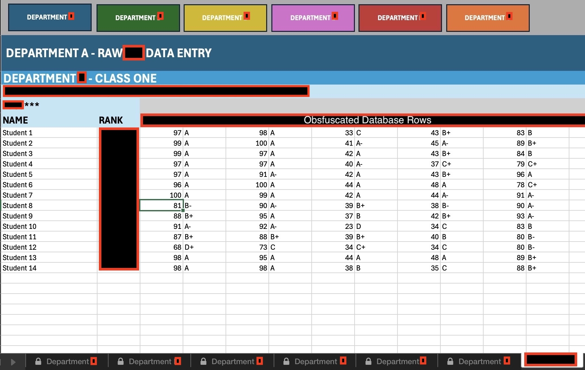
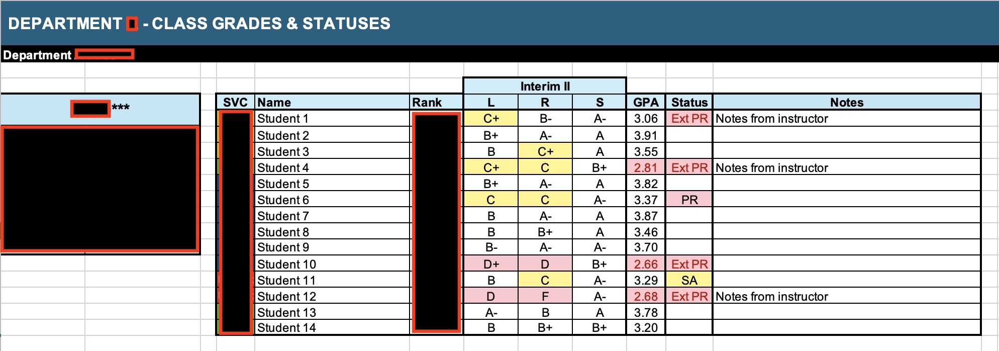

### 🎯 Problem
Our team was spending a lot of time formatting class progress reports. Instructors were:
- Inputting student grades by typing them into PowerPoint slides for biweekly reports.  
- Manually color-coding passing vs. failing grades with no standardization.  
- Producing inconsistent reports formats for each department and class, leading to confusion.
- Manually typing grades into PDF reports for commanders, which was slow and error-prone.  

While there was a database in place, the exported reports weren’t useful. For attrition purposes, leadership only needed to see performance on major unit tests, but the system buried that data alongside other minor grades.

There was also no centralized place for leadership to view current student statuses. Every department (and even each class) tracked progress differently.    

### 💡 Solution
I worked with our team to design an Excel dashboard, transforming raw database outputs into standardized, centralized reports with automated conditional formatting.  This helped improve coordination both internally and with external stakeholders such as service units.

Excel was chosen because it was already widely available, familiar to instructors, and quick to deploy without new licensing or training. By leveraging modular formulas and conditional formatting, the tool delivered immediate value at a low cost as the institute worked on larger LMS overhauls.

The system included two core tools:    

#### 1. Schoolhouse Dashboard  
- One workbook with separate color-coded sheets for each department.  
- Built-in navigation buttons for quick switching during biweekly syncs.
- Instructors pasted raw grade exports, and the system auto-formatted results.  
- Conditional formatting automatically flagged marginal and failing scores, ensuring consistency across all departments.  
- A dropdown selector enabled instructors to display each classes most recent results for a particular test across the three testing modalities (listening, reading, speaking).  
- Leadership could review all departments from one place right out of a teams chat tab.    

> The dashboard used VLOOKUP and a dropdown selection to match raw database outputs to student names and automatically pull the correct class data into the view.

 

#### 2. Class Reports  
- Designed to display a consecutive view of the major milestones in the year-long course.  
- Conditional formatting highlighted students meeting criteria for academic probation, special assistance, or attrition board review.  
- Displayed performance trends in a linear format needed to assess intervention criteria.  
- Generated individual student reports with letter grades for each modality across all tests—commander-ready at a glance.    

> This reporting tool relied on the same modular VLOOKUP structure and design, taking raw test scores for each student and compiling them into standardized reports.

 

### 🚀 Impact
#### ⏱️ Time Savings
- Eliminated manual grade entry into PowerPoints and individual excel sheets
   
#### 📊 Standardization
- Created consistent reporting format across the entire schoolhouse
- Made performance data accessible via SharePoint and Teams
   
#### 🎯 Decision-Making
- Dramatically improved speed of academic intervention and attrition board scheduling
- Modular design allowed adaptation across multiple departments and curriculums   

### 📸 Screenshots   

#### 📊 Raw Database Export  
Modular input meant instructors could just copy and paste raw data from the database report. The raw columns of data were hard to read and parse through.

   

#### 📑 Individual Class Report
This dashboard was updated after each major test to track a class' progress throughout the program and identify students meeting attrition criteria.

    

#### 🏫 Schoolhouse Dashboard View
This view was used to show a summary of an individual class' most recent test. It was used primarily for biweekly syncs to update service units on class progress, but was accessible to the service units via SharePoint or Teams as well.

  

#### 👤 Individual Student Report  
Report that the tool generated for commanders, displaying a student's grades across all unit tests and modalities.  

