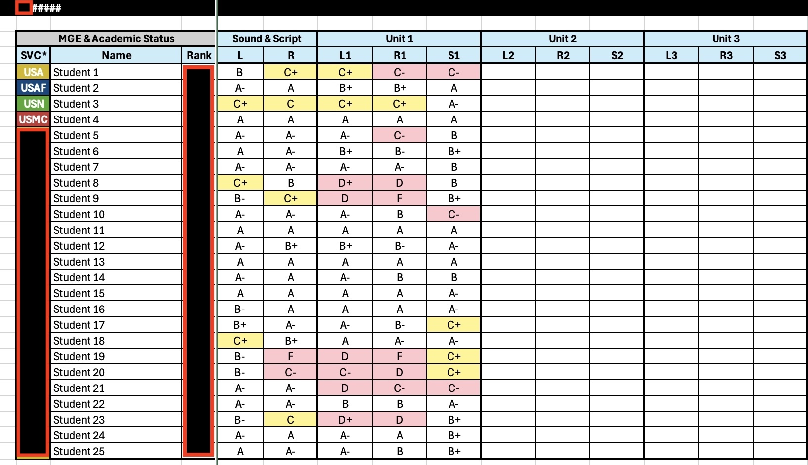
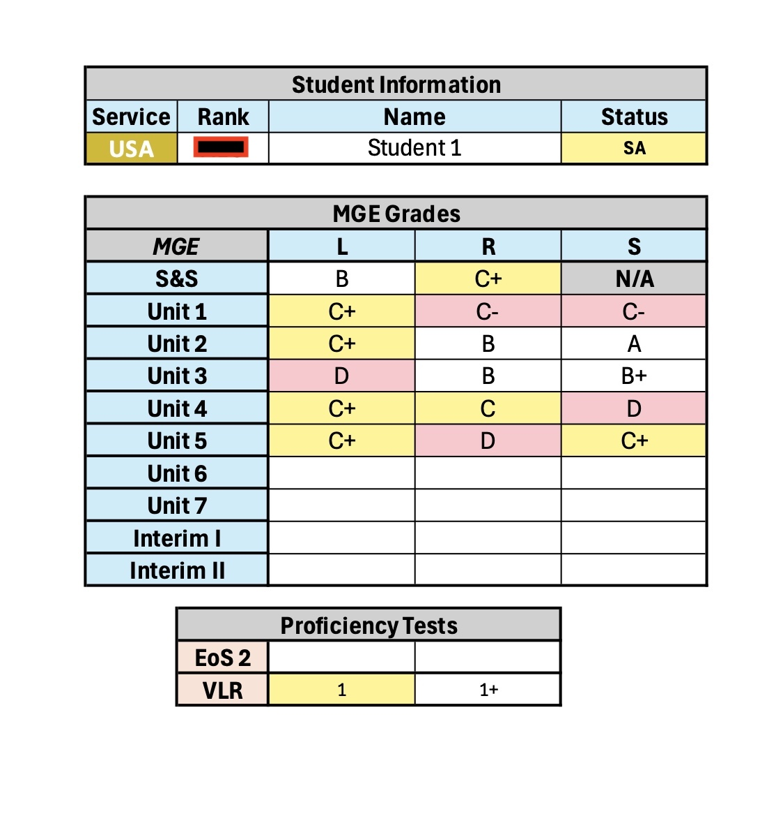

### 🎯 Problem
When I first joined my team at DLI, I noticed an immediate pain point. Instructors were:
- Inputting student grades by typing them into PowerPoint slides for biweekly reports.  
- Manually color-coding passing vs. failing grades with **no standardization**.  
- Producing inconsistent reports formats for each department and class.  
- Manually typing grades into PDF reports for commanders, which was slow and error-prone.  

While there was a database in place, the exported reports weren’t useful to the people doing the work or making decisions. For attrition purposes, leadership only needed to see performance on **major unit tests**, but the system buried that data alongside homework and minor grades.

There was also no centralized place for leadership to view current student statuses. Every department (and even each class) tracked progress differently.    

### 💡 Solution
I designed and deployed an Excel dashboard, shared via SharePoint between the service units and the schoolhouse, that transformed raw grade database outputs into standardized, centralized reports with automated conditional formatting.  

Excel was chosen because it was already widely available, familiar to instructors, and quick to deploy without new licensing or training. By leveraging modular formulas and conditional formatting, the tool delivered immediate value while larger, long-term systems like Canvas were still years from full integration.  

The system included two core tools:    

#### 1. Schoolhouse Dashboard  
- One workbook with **separate color-coded sheets for each department**.  
- Built-in **navigation buttons** for quick switching during leadership meetings.  
- Instructors pasted raw grade exports, and the system auto-formatted results.  
- **Conditional formatting** automatically flagged marginal and failing scores, ensuring consistency across all departments.  
- A dropdown selector displayed each class’s current results for a particular test across the three testing modalities (**listening, reading, speaking**).  
- Leadership could review all departments from one place, right from a Teams chat tab.    

> Thee dashboard used VLOOKUPs and a dropdown selection to match raw database outputs to student names and automatically pull the correct class data into the view.

 

#### 2. Class Reports  
- Designed to display a consecutive view of the major milestones in the year-long course.  
- **Conditional formatting** highlighted students meeting criteria for academic probation, special assistance, or attrition board review.  
- Displayed performance trends in a **test-by-test format** needed to assess intervention criteria.  
- Generated **individual student reports** with letter grades for each modality across all tests—commander-ready at a glance.    

> This reporting tool relied on the same modular VLOOKUP structure and design, taking raw test scores for each student and compiling them into standardized reports.

 

### 🚀 Impact
- **Eliminated manual grade entry** into PowerPoints, memos, and slides.  
- **Standardized reporting** across the entire schoolhouse.  
- Made performance data **highly accessible** in SharePoint and a Teams chat tab. 
- Dramatically improved speed and accuracy of academic intervention and attrition boards.  
- Because the tool was modular, it was adopted not only at my schoolhouse but also adopted other schoolhouses as a stopgap solution as we transitioned to a new LMS.
- The **modular, navigable design with conditional formatting** made it adaptable to multiple departments and curriculums.    

### 📸 Screenshots   

#### 📊 Raw Database Export  
Modular input meant instructors could just copy and paste raw data from the database report.

    

#### 🏫 Schoolhouse Dashboard View  
Centralized dashboard with color-coded departments and service identifiers for quick visibility.  

    

#### 📑 Formatted Class Report  
Conditional formatting highlights marginal/failing scores on a particular test. 

  

#### 👤 Individual Student Report  
Report for commanders, displaying a student's grades across all unit tests and modalities.  
  

### 📌 Key Takeaways
This project replaced fragmented manual processes with a centralized, modular system that gave leadership clearer visibility into student performance, streamlined interventions, and influenced updates to academic reporting practices across the institute.
