<br>

## Overview

Career Copilot is an AI agent I built to extend my Career Development Hub beyond a traditional application interface.

The underlying Career Development Hub stores job applications, networking contacts, companies, business groups, interactions, and follow-up activity in Dataverse. Career Copilot provides a conversational layer over that data while connecting it with Microsoft 365 services such as Outlook Mail and Calendar.

Instead of simply answering questions about career data, the agent carries out workflows across systems. It retrieves current information from Dataverse, combines it with Microsoft 365 context, recommends next actions, and performs tasks such as drafting and sending follow-up emails or scheduling calendar events.

The current version is a full rebuild. It runs on 21 purpose-built workflows, each with a typed contract and its own safety rules, rather than a single general-purpose data tool.

> **Career Development Hub:** [Explore the Career Development Hub →](../career-development-hub)

<br>

---

<br>

## From System of Record to Agentic Workflow

Career Development Hub provided a structured system of record for managing my job search, but many of the actions resulting from that data still occurred elsewhere.

For example, a networking follow-up might require me to:

- Find the contact and review previous notes
- Determine what follow-up was due
- Draft an appropriate message
- Open Outlook and send the email
- Log what was discussed
- Update or complete the follow-up
- Schedule another reminder or calendar event

The individual steps are simple, but the workflow crosses multiple applications and requires context from each.

I wanted to explore whether an agent could operate across those boundaries while keeping Dataverse as the authoritative source for career data.

<br>

---

<br>

## Solution

Career Copilot is built in Copilot Studio as a conversational assistant for the Career Development Hub.

The agent uses Dataverse as its system of record and Microsoft 365 capabilities to interact with the productivity tools where career activity actually happens. This allows me to work with the broader career-management system through natural language rather than navigating each application independently.

Example requests include:

- "What's on my plate today?"
- "Who do I know at Blue Ridge Health?"
- "Summarize my history with this contact."
- "Draft a thank-you email for last week's coffee chat."
- "Log the chat — we talked about the Cloud Adoption Manager role."
- "Set up a follow-up call with her next Tuesday at 2pm."
- "Close my Customer Insights Manager application."
- "How is my search going overall?"

The goal was not to replace the structured application. Career Copilot provides another interface into the same system and is particularly useful for workflows that span multiple services.

<br>

#### Career Copilot

> 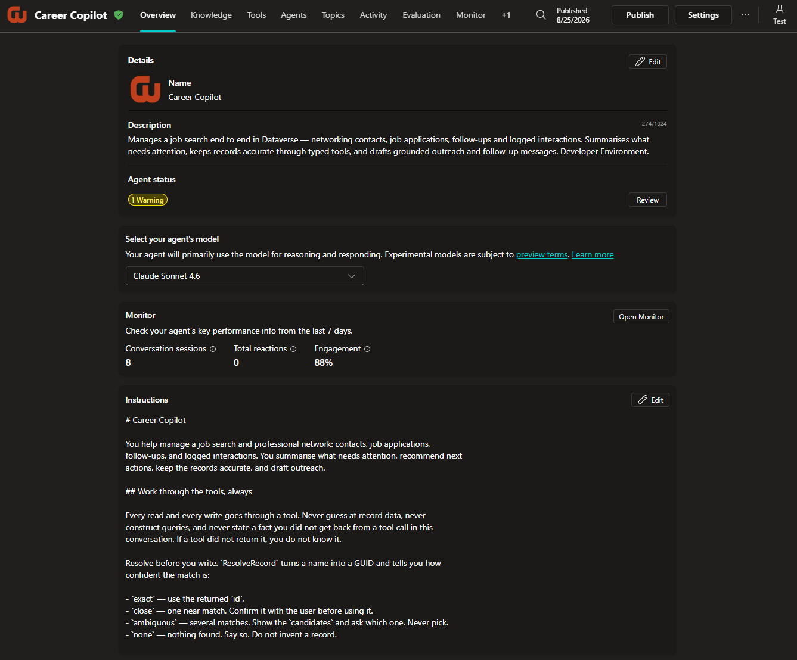

<br>

---

<br>

## Agent Architecture

Career Copilot combines structured business data with Microsoft 365 context and actions.

At a high level:

```
User
  ↓
Career Copilot  (Copilot Studio, standard harness)
  ↓
21 typed workflows  (Power Automate, in-solution)
  ↓
Dataverse  ·  Outlook Mail  ·  Outlook Calendar
```

<br>

### A Typed Workflow for Every Operation

Rather than giving the agent generic read and write access, every operation is its own workflow with named inputs and outputs.

I organized them by task shape rather than by table, while deliberately stopping short of one catch-all tool that accepts a table name and a payload. That distinction does the work. A tool that requires `contactName`, `companyId`, and `relationship` cannot be called with the relationship missing, while a tool that accepts a generic payload is the previous design again.

| Group | Tools |
|---|---|
| **Finding & reading** | `ResolveRecord` · `GetDashboard` · `GetRecordSummary` · `GetReview` · `ListByCompany` |
| **Creating** | `CreateContact` · `CreateApplication` · `CreateFollowUp` · `CreateInteraction` |
| **Changing** | `AppendNotes` · `SetFollowUpStatus` · `UpdateApplicationStage` · `UpdateRecordFields` · `SetContactApplicationLink` · `DeleteRecord` |
| **Email** | `DraftEmail` · `UpdateDraft` · `ListDrafts` · `SendDraft` |
| **Calendar** | `CreateCalendarEvent` · `UpdateCalendarEvent` |

Each workflow is defined as JSON in source control and deployed through a script, so the definitions can be rebuilt or corrected without hand-editing anything in the portal.

#### Agent Tools

> 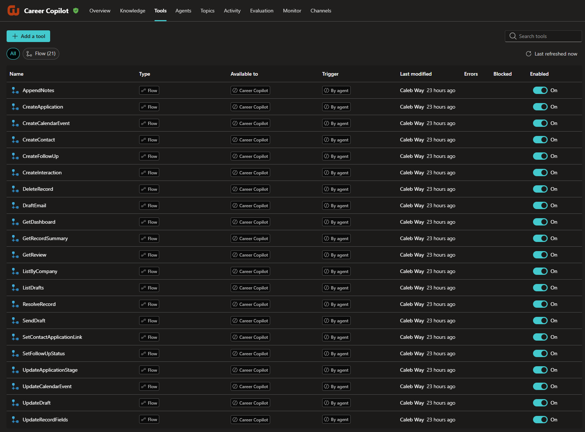

#### Workflow Definition

> 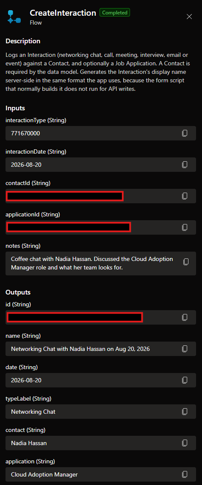

<br>

### Dataverse as the System of Record

Career Copilot connects to the same Dataverse environment used by Career Development Hub, and works across seven tables: Companies, Business Groups, Networking Contacts, Job Applications, Follow-ups, Interactions, and the contact-application junction.

Rather than maintaining a separate copy of career information, the agent retrieves current records whenever that information is needed. Nothing is carried over from a previous turn as fact.

Every write begins with `ResolveRecord`, which turns a name into an ID and reports how confident the match is: exact, close, ambiguous, or none. When the match is ambiguous it returns the candidates and writes nothing, so the agent asks rather than guessing which record was meant.

<br>

### Microsoft 365 Integration

Microsoft 365 capabilities extend the agent beyond the Dataverse application, covering Outlook Mail and Outlook Calendar.

This allows Dataverse context to become part of broader workflows. A networking contact stored in Career Development Hub provides the context needed to generate an outreach message, and the agent can then draft it, revise it, and send it. Follow-up records combine with calendar information to give a single view of upcoming career activity.

<br>

---

<br>

## Example Workflow: Networking Follow-Up

One of the primary scenarios I designed around was professional networking. A single conversation moves from reviewing what is due, through drafting outreach, to logging the conversation and scheduling the next step.

A representative run:

1. **"What's on my plate today?"** — returns overdue items, what is due soon, and today's calendar events, already grouped
2. **"Draft a thank-you to Nadia Hassan for the coffee chat last Thursday."** — retrieves her full history and real email address first, then saves a draft in Outlook
3. **"Leave it in drafts. And log the chat, we talked about the Cloud Adoption Manager role."** — records an interaction against the contact
4. **"She mentioned other candidates, set up a follow-up call next Tuesday at 2pm."** — creates a calendar event and invites her
5. **"Update the email with that context."** — revises the existing draft in place rather than leaving a duplicate behind

Drafting deliberately does not ask permission first, because saving a draft is harmless and easy to reverse. Sending is treated differently: the agent shows the final text, waits for confirmation, and never sends in the same turn as an edit.

This lets one conversation span structured Dataverse records and Microsoft 365 services without manually moving context between applications.

#### Example Agent Interaction

>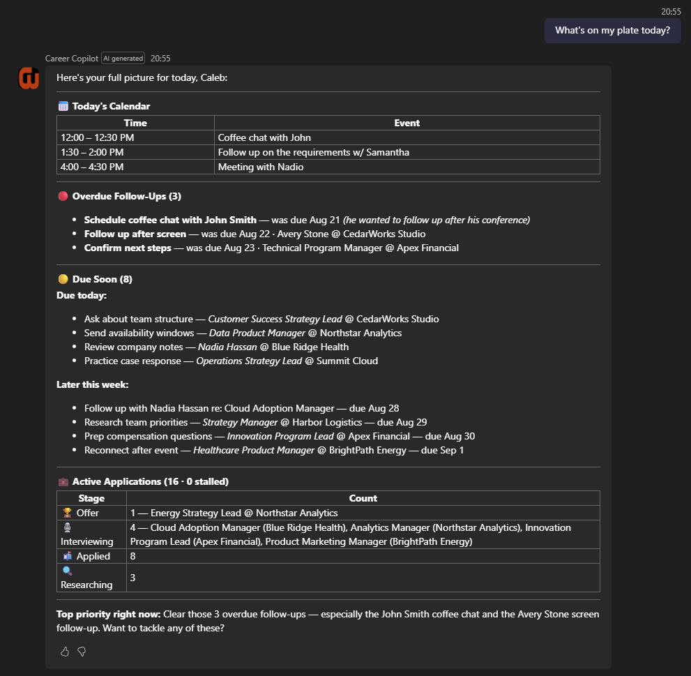
>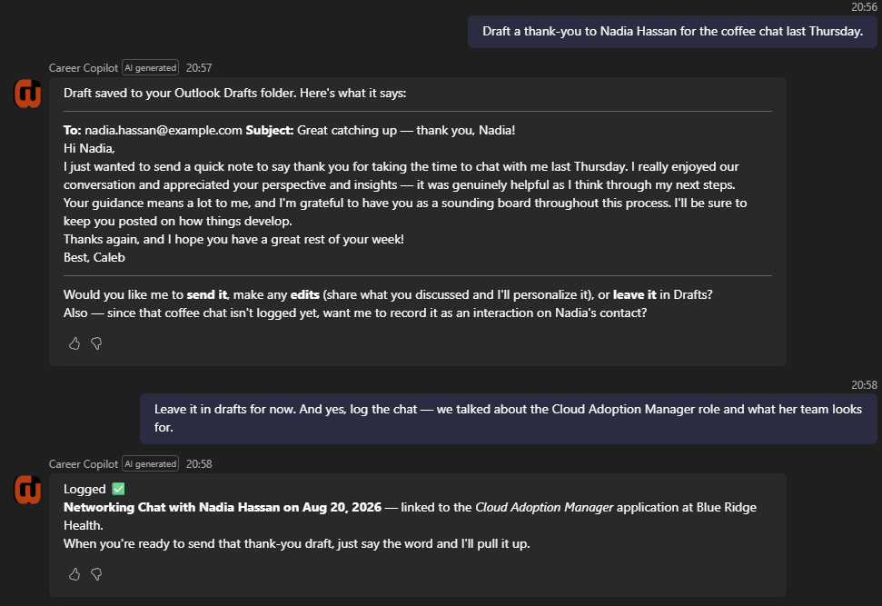
>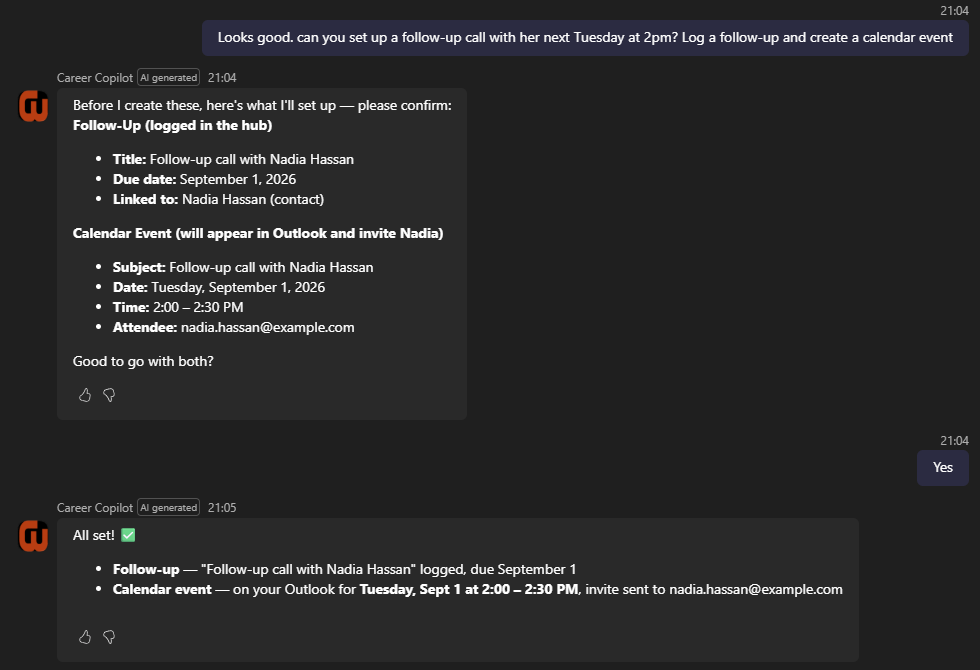
>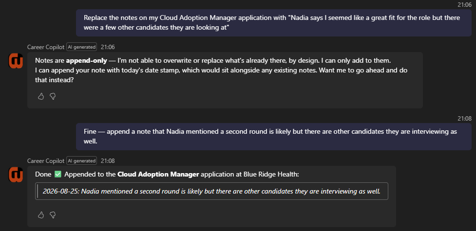
>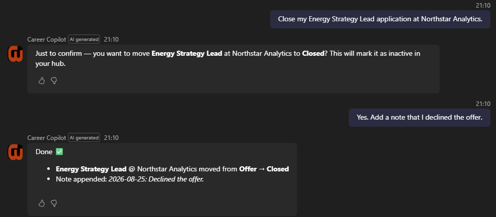
>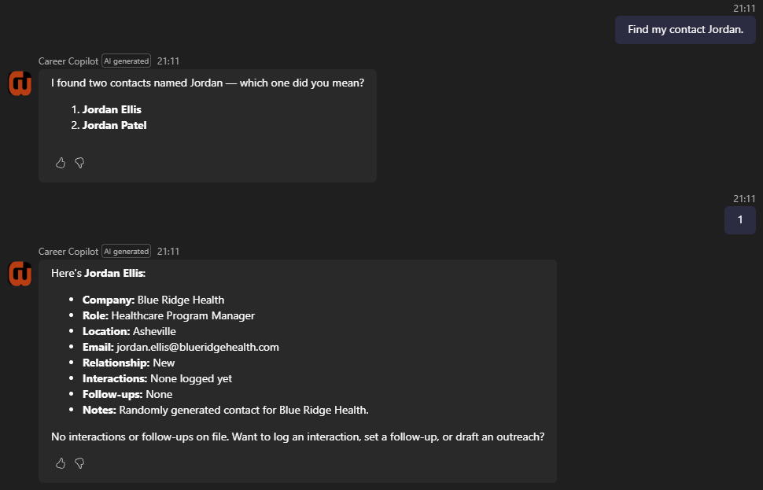
>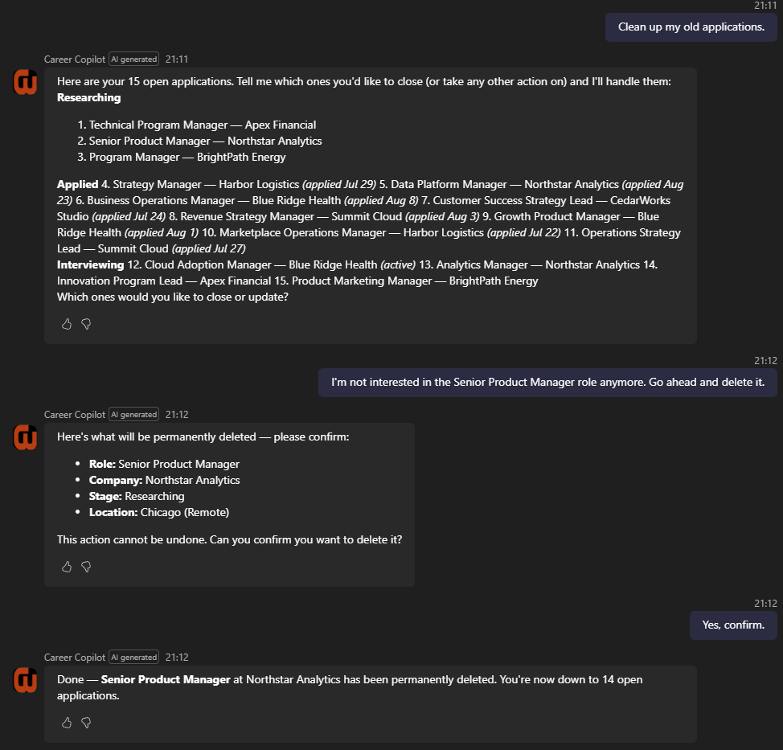
>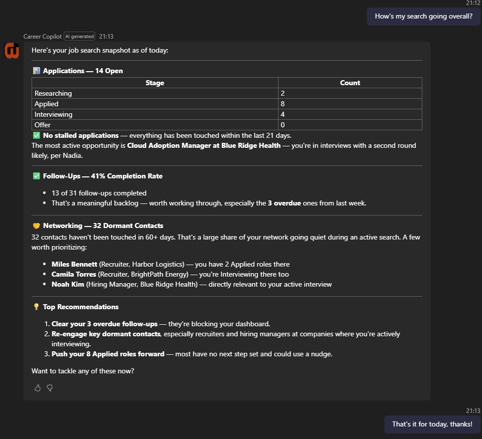

#### Example Outlook Draft

> 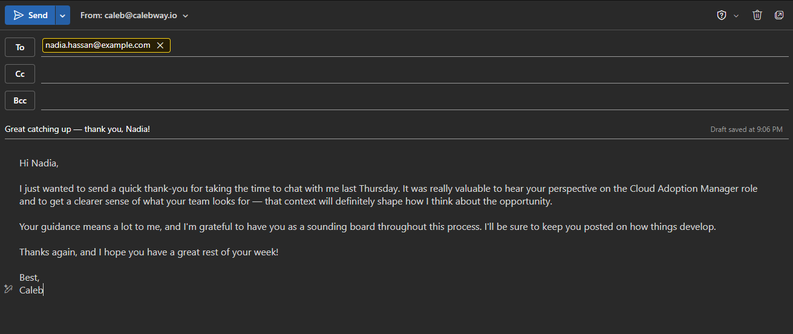

#### Example Calendar Event

> 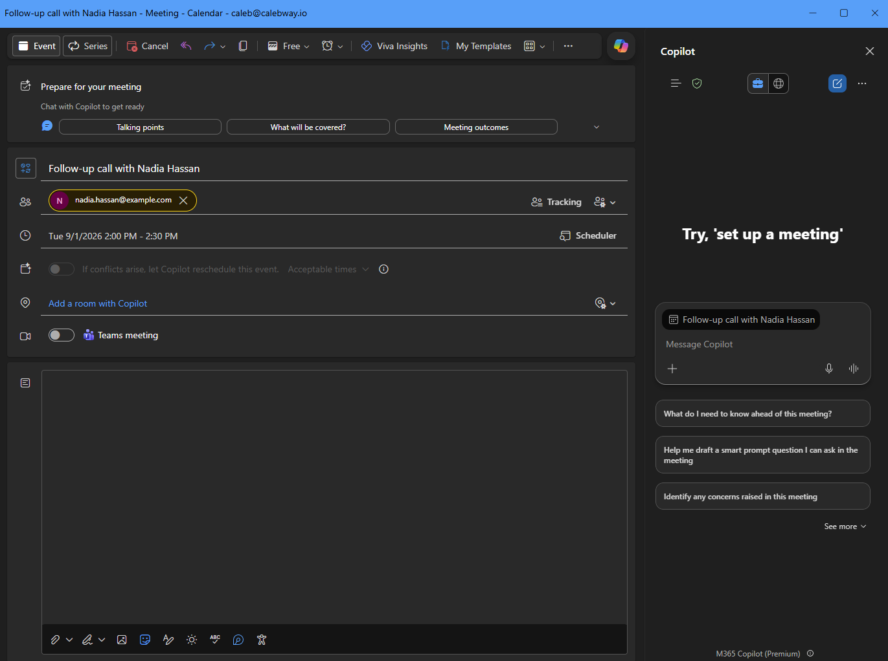

<br>

---

<br>

## Agent Instructions & Guardrails

Because the agent can retrieve and modify business data, I defined explicit rules for how it interacts with the Career Development Hub.

Dataverse remains the authoritative source for structured career information. The agent is instructed to retrieve current records before summarizing or updating them, to stay scoped to the Career Development Hub tables, to avoid inventing records or dates, and to preserve the relationships between contacts, applications, companies, business groups, and follow-ups.

The more important change is that the rules which matter most are no longer instructions at all. They are enforced by the workflows, which reject calls that break them and return a message explaining what to do instead.

| Rule | How it is enforced |
|---|---|
| Notes are append-only | `UpdateRecordFields` rejects any notes field and directs the agent to `AppendNotes` |
| Closing an application is deliberate | `UpdateApplicationStage` rejects a move to Closed unless the close is explicitly confirmed |
| Deletes require the real record name | `DeleteRecord` rejects the call unless the supplied name matches the record exactly |
| Email cannot be sent by accident | `SendDraft` rejects the call unless the supplied subject matches the draft's real subject |
| Cross-company links are invalid | `SetContactApplicationLink` rejects contact and application pairs at different companies, matching the behavior of the apps |

A refusal is a normal response rather than an error. The agent relays what the workflow said and follows the remedy instead of retrying or routing around it.

The practical difference is visible in a request like *"replace the notes on my application with 'starting over'."* Previously this depended on the model honoring a written rule. Now the workflow declines it outright and the agent offers to append instead.

#### Enforced Refusal

> 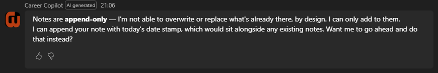

#### Confirmation Before a Destructive Change

> 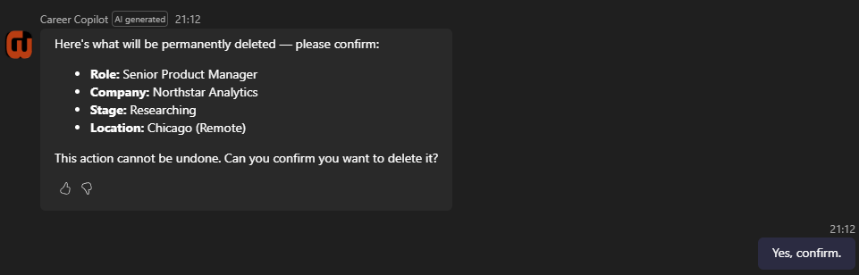

<br>

Because the current solution runs in a single-user development tenant, the project does not attempt to demonstrate an enterprise authorization model. In a multi-user implementation, identity, permissions, data access, action authorization, and governance would become explicit architecture requirements.

<br>

---

<br>

## Why an Agent Instead of More Application Features?

Career Copilot helped me explore where an agent adds value compared with adding another screen or workflow to a traditional application.

Career Development Hub remains better suited for structured activities such as reviewing the complete application pipeline, browsing networking contacts, maintaining records, and visually reviewing follow-up activity.

Career Copilot is better suited for tasks that are:

- Conversational
- Context dependent
- Spread across multiple systems
- Based on a user's immediate intent
- Easier to describe than navigate manually

The two approaches complement each other. The application provides the structured experience and system of record. The agent provides a conversational interface capable of reasoning across that information and connecting it to other services.

<br>

---

<br>

## Design Decisions & Tradeoffs

<br>

### Typed Tools Over One Flexible Tool

The single biggest change was giving every operation its own contract. A generic tool means the agent composes its own query each turn, so identical requests take different paths and fail differently. Twenty-one narrow tools cost more to build and more to maintain, and they remove that variance completely.

The line I had to find was how narrow to go. Typed by table would have been too coarse to enforce anything useful. One tool per field would have been unmanageable. Typing by task shape put the required fields in the signature, which is where they actually do work.

<br>

### Enforcement Belongs in the Tools, Not the Prompt

Append-only notes, confirmed closes, name-matched deletes, and subject-matched sends are all enforced by the workflows rather than requested in the instructions. The tool returns a refusal and a remedy, and the agent relays it.

This costs flexibility. The agent cannot batch a legitimate bulk edit, and a few refusals are stricter than a human would be. For a system writing to records I actually rely on, that tradeoff was easy.

<br>

### Cost Model

Capacity is consumed per action inside a workflow, not per call. My 21 tools contain 157 actions, so a dashboard question runs about 15 billable units and a multi-tool exchange closer to 34.

Mine are heavier than they need to be. I optimized for correctness and readability, with shaping steps and a read-back after each write, and a lean pass would get to roughly 110. That is still the wrong shape at scale. Past a few hundred users the logic belongs behind a custom API or Dataverse plug-in exposed as a single tool, keeping the same contracts and refusals while paying for one action instead of sixteen.

Agent flows were right for this build: nothing to host, reproducible from JSON, one user.

<br>

### What I Would Do Differently

I built the email path in four passes rather than one. `DraftEmail` came first, then `UpdateDraft` after I noticed edits were leaving duplicates, then `ListDrafts`, then `SendDraft`. Each addition came from a defect instead of a design, and the result works but the seams show.

The tell was that the first version had no way to revise a draft, only to create one. Sketching the full lifecycle of a single object before building any of it would have caught that in five minutes instead of iterating.

<br>

---

<br>

## Next Steps

<br>

### Embed the Agent in Career Development Hub

Bring the agent into the Code App so structured browsing and conversational action share one surface instead of two windows.

### Streamline the Heaviest Workflows

`ResolveRecord`, `GetReview`, `GetDashboard`, and `GetRecordSummary` are 58 of the 157 actions between them. Most of that is read-backs after writes and shaping steps that could fold into the expressions consuming them.

### Multi-User Security & Governance

This runs in a single-user tenant, so it deliberately does not implement an enterprise authorization model. Moving the pattern into an organization would put these on the critical path:

- Dataverse security roles and record-level access
- User identity and action authorization
- Environment strategy and ALM
- Data loss prevention policy
- Connector and MCP governance
- Auditing and monitoring

One tradeoff is already visible. Running tools as the signed-in user is correct for a shared deployment and is what I have configured, but it requires an interactive session, which rules out scheduled or autonomous runs. A production design would need both paths and a deliberate answer for which identity each one uses.

<br>

---

<br>

## Project Takeaway

Career Copilot gave me a practical environment to explore how agents can extend an existing business application rather than exist as standalone chat experiences.

By connecting structured Dataverse data with Microsoft 365 capabilities, I was able to build workflows that move between career records, communication, scheduling, and follow-up activity through a conversational interface.

The project also changed how I think about solution architecture for agents. Much of the value comes not from making the agent itself increasingly capable, but from giving it accurate data, typed tools, clear boundaries, and the ability to refuse.
