 

## Overview

Career Development Hub is a personal career management application I built to bring networking, job applications, and follow-up activity into one connected system.

I developed the application during my own career transition after finding that the information supporting a job search was often fragmented across spreadsheets, LinkedIn, company career portals, calendar reminders, and personal notes.

Beyond solving that problem, I used the project as an opportunity to explore Microsoft's newer Power Apps Code Apps development model and gain hands-on experience building a code-first application on top of Dataverse within my own Microsoft tenant.

The resulting application combines a custom React and TypeScript interface with a relational Dataverse backend, while using Power Platform as the foundation for data management and future automation.

 

---

 

## Problem

Managing a job search involves more than tracking submitted applications.

Applications are connected to companies, networking conversations, recruiters, hiring managers, interviews, and follow-up actions. As the number of opportunities and contacts grows, that context can quickly become fragmented.

I wanted a system that could answer questions such as:

- Which applications are currently active?
- Who do I know at a particular company?
- What follow-ups are overdue or coming up?
- Where is each application in the hiring process?
- What context do I need before reconnecting with someone?

A spreadsheet could track individual records, but I wanted to model the relationships between them and create an application designed around the workflow itself.

 

---

 

## Solution

I designed Career Development Hub around three primary workflows: networking, job applications, and follow-up management.

Instead of treating these as independent lists, the application connects them through a Dataverse data model. Contacts and applications can be associated with companies and business groups, while follow-ups retain context about the contact or application they relate to.

The application provides four primary experiences:

- A dashboard for quickly understanding current activity
- Networking contact and relationship management
- A job application pipeline
- Integrated follow-up management with list and calendar views

 

### Career Dashboard

The dashboard provides a high-level view of the current job search and surfaces information requiring attention.

- Application pipeline grouped by stage
- Upcoming and overdue follow-ups
- Calendar preview of scheduled activity
- Quick-create actions for contacts, applications, and follow-ups
- Direct navigation into detailed application and calendar views

Rather than acting only as a reporting page, the dashboard serves as the starting point for common workflows throughout the application.

 

#### Dashboard View

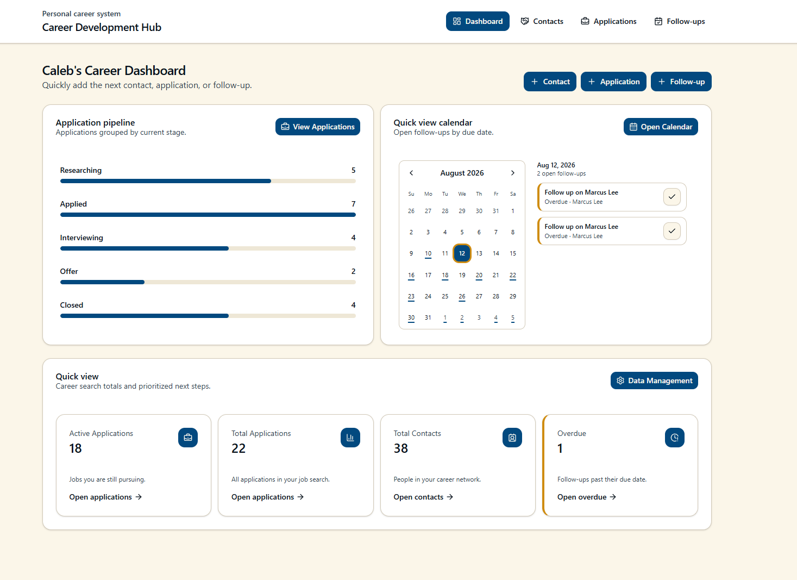

 

---

 

### Networking & Relationship Management

The networking workspace provides a structured way to maintain professional relationships alongside the companies and opportunities they relate to.

Each contact can include:

- Company and business group
- Role
- Relationship type
- Contact information
- Relationship context and notes
- Associated follow-up activity

Search and filtering allow contacts to be located across multiple fields or narrowed by company and business group.

This structure makes networking information part of the same system as the application pipeline rather than maintaining a separate contact list.

 

#### Networking Contacts View

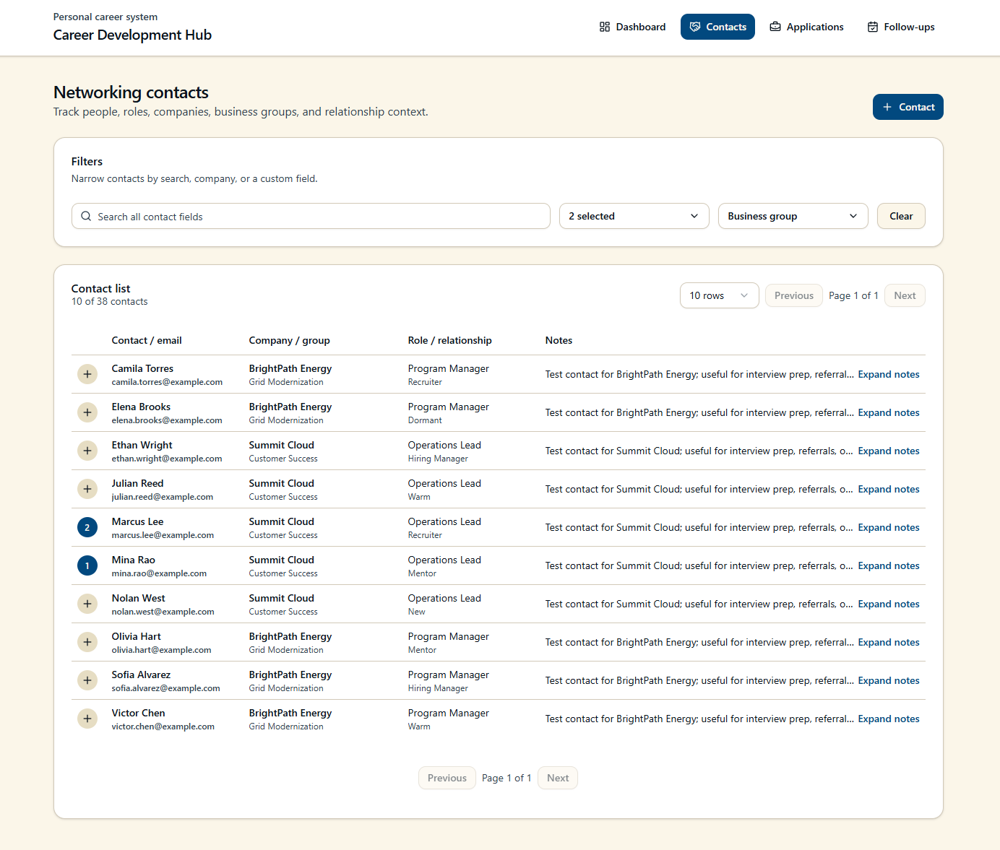

#### Application Edit

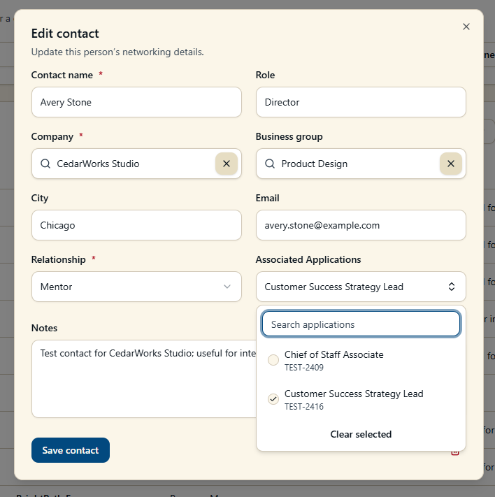

 

---

 

### Application Pipeline

The application workspace tracks opportunities throughout the hiring process while retaining organizational and role-specific context.

Applications include information such as:

- Role and job ID
- Company and business group
- Location and work arrangement
- Application stage
- Application date
- Job posting link
- Notes and related context
- Associated follow-up activity

Applications can be searched and filtered by stage, company, business group, and other fields, allowing the same interface to support both an active job search and historical opportunity tracking.

 

#### Application View

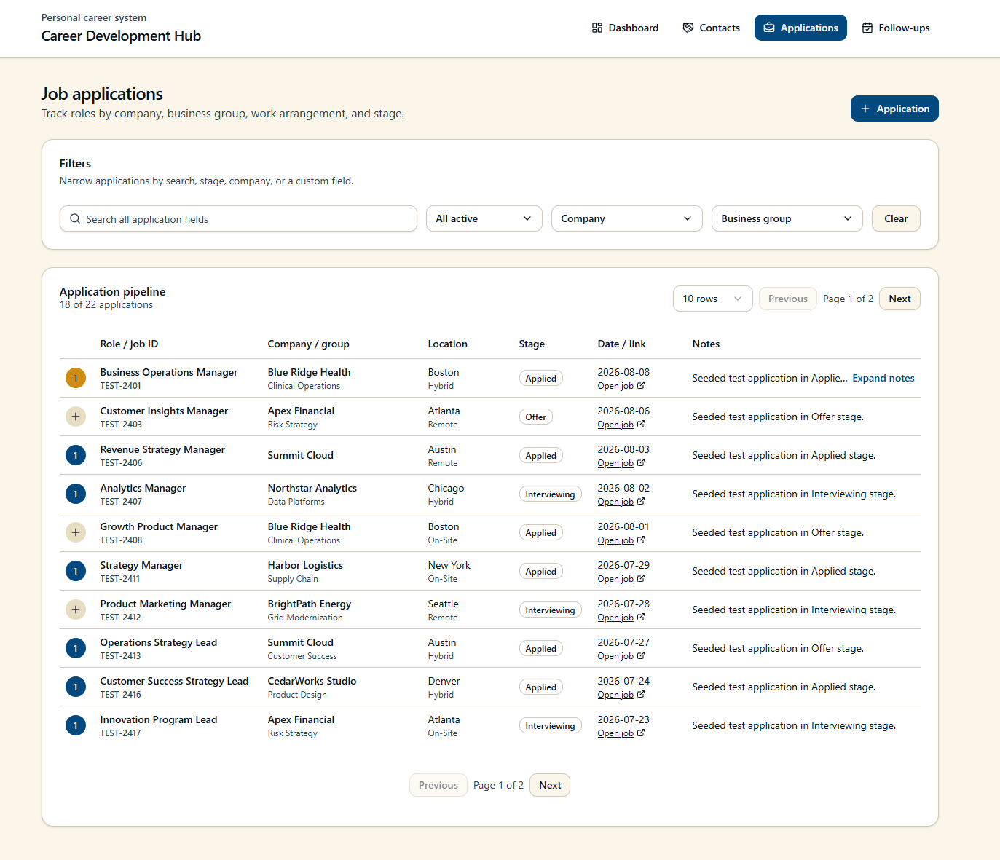

#### Application Edit

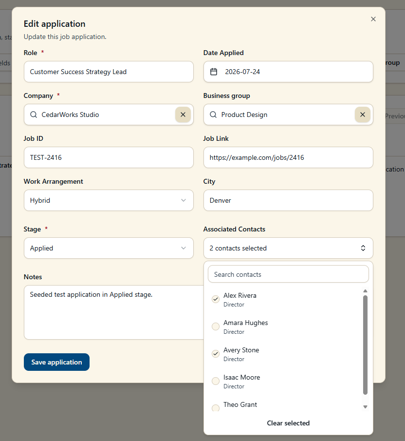

 

---

 

### Follow-up Management

Follow-ups connect actions and reminders directly to the records that created them.

A follow-up can be associated with a networking contact, job application, or used as a standalone career task. This preserves context that would otherwise be lost in a generic task or calendar reminder.

The follow-up experience includes:

- Open and completed states
- Action-needed and overdue identification
- Contact and application associations
- Search and type filtering
- List and calendar views
- Day, week, and month calendar navigation
- Direct completion from the interface

The dashboard also surfaces current follow-up activity so upcoming actions remain visible without opening the full follow-up workspace.

 

#### Follow-up List

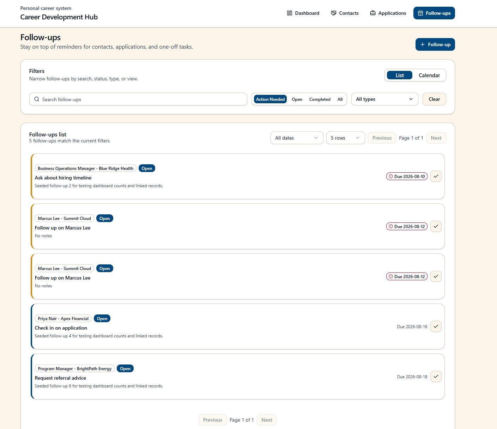

 

#### Calendar View

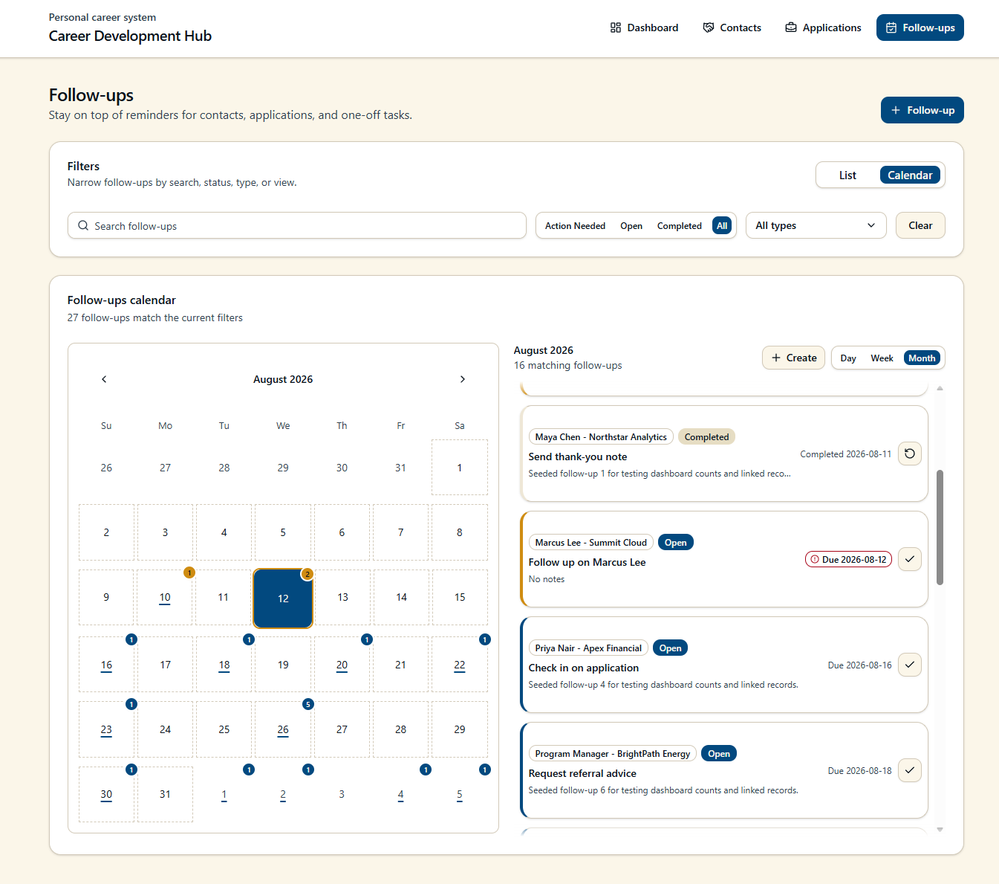

#### Follow-up Edit View

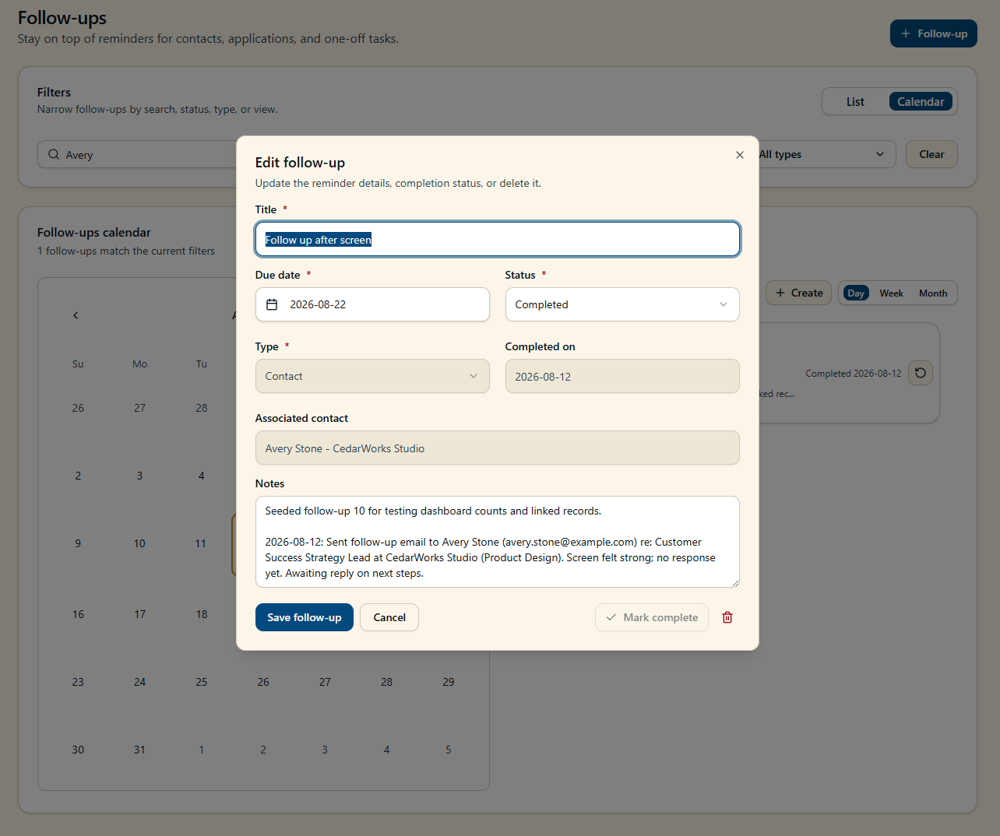

 

---

 

## Architecture & Data Model

Career Development Hub uses a Power Apps Code App as its primary interface with Dataverse serving as the system of record.

The application was built and deployed within my own Microsoft tenant, giving me the ability to work across the application, data, and platform layers rather than developing the interface in isolation.

 

### Relational Data Model

The data model was designed around the relationships that emerge during a career search rather than treating each part of the process as an independent dataset.

At a high level:

- **Companies** provide the organizational parent for contacts and applications
- **Business Groups** provide additional organizational context within companies
- **Contacts** represent professional relationships and networking activity
- **Applications** represent individual job opportunities and their current stage
- **Follow-ups** connect time-based actions to contacts, applications, or standalone tasks
- **Contact Application** is an intersection table, handling relationships between associated contacts and applications

This allows the application to retain context across workflows. A follow-up, for example, can represent more than a reminder: it can identify who the action relates to, which opportunity it supports, and when it requires attention.

 

#### Data Model

> 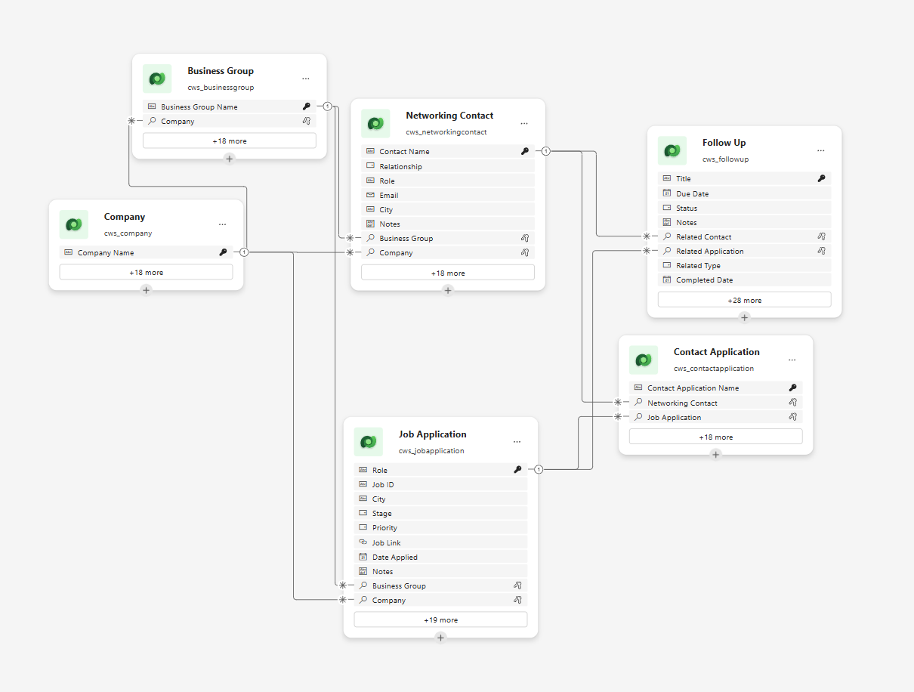

 

---

 

## From SharePoint to Dataverse

The first version of Career Development Hub used SharePoint lists as its backend.

SharePoint worked surprisingly well for the initial implementation and demonstrated that the workflow could be supported without introducing a more complex data platform. For a lightweight deployment with relatively simple relationships, it would remain a viable architecture.

As the application evolved, however, relationships between companies, business groups, contacts, applications, and follow-ups became increasingly important.

I rebuilt the backend using Dataverse to better support:

- Relational data modeling
- Lookup relationships between records
- Referential integrity
- Native Power Platform integration
- More structured application data
- Future expansion of the solution

The experience reinforced that platform selection should follow the requirements of the application. SharePoint was sufficient for the initial problem, while Dataverse became the stronger fit as the solution became more relational. I also wanted to get more hands-on with Dataverse when integrating with agents and apps.

> Example Sharepoint Data Model
> 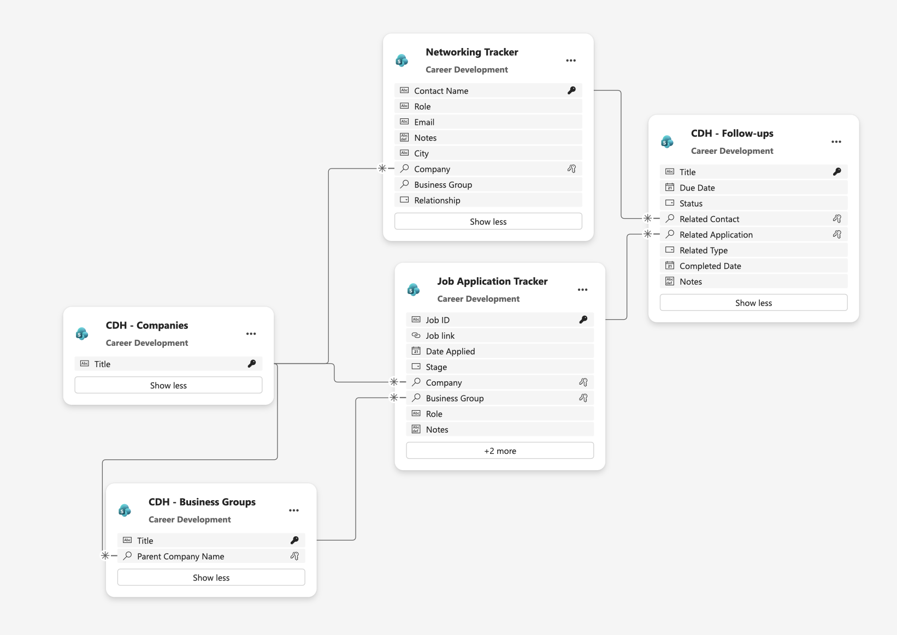

 

---

 

## Building with Power Apps Vibe

I built the application using Microsoft's emerging Power Apps Vibe experience, an AI-assisted development environment that generates applications, data models, and supporting code from natural language requirements. 

Rather than building every interface component manually, I worked collaboratively with the AI development environment by defining business requirements, refining generated solutions through iterative prompting, and validating the application's behavior against intended use cases.

I designed and refined the underlying Dataverse data model, tested generated functionality, resolved issues, and made decisions around user experience, workflow design, and overall application architecture.

Throughout the project, I gained practical experience evaluating AI-generated implementations, identifying gaps, improving generated solutions, and balancing low-code and traditional development approaches to deliver a working business application.

The experience strengthened my understanding of how modern Power Platform tools can accelerate solution delivery while still requiring human oversight, business analysis, data modeling expertise, and technical judgment.

#### Power Apps Vibe Limitions 
While the Vibe development experience significantly accelerated application development, it also gave me a realistic view of the current limitations. As the application grew in complexity, longer development sessions became increasingly resource-intensive. I initially worked from a MacBook but eventually moved to my desktop workstation after experiencing browser instability and crashes.

I also found the development workflow required a different mindset than traditional coding. Generated code was presented in a read-only format, which meant changes had to be made through prompts rather than direct edits. Success depended heavily on providing clear, specific instructions and limiting requests to a small number of actions at a time. More complex troubleshooting scenarios often required breaking problems into smaller steps and iterating toward a solution rather than expecting the platform to autonomously reach the desired end state.

At the same time, these limitations helped me develop stronger skills in requirements gathering, validation, and solution refinement. The platform was particularly effective when integrating Power Platform services and Work IQ MCP capabilities.

 

#### PowerApps Vibe Interface

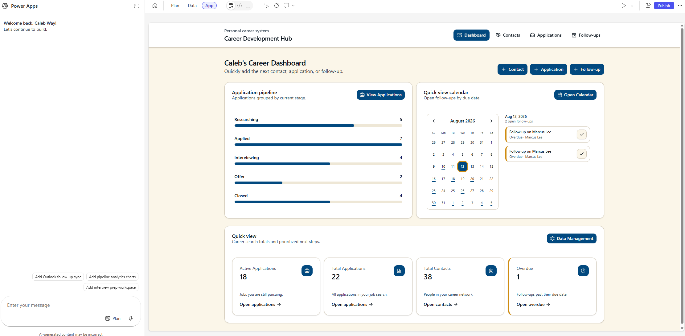
 

---

 

## Data Management & Administration

Building the primary workflows exposed another requirement: maintaining the data behind the application.

Rather than relying on direct Dataverse table editing, I built a management interface for administrative operations across the system.

The panel supports functions including:

- Bulk record management
- Bulk status and stage changes
- Duplicate identification and cleanup
- Exporting data to a CSV file
- Company and business group management
- Merging duplicate organizational records
- Reassigning linked records during merges
- Preventing deletion of records with unresolved dependencies

For example, merging duplicate business groups first moves their associated contacts and applications to the selected destination record before removing the duplicate.

This separated routine career-management workflows from administrative data-maintenance workflows and helped keep the primary interface focused on day-to-day use.

 

#### Data Management Panel

> 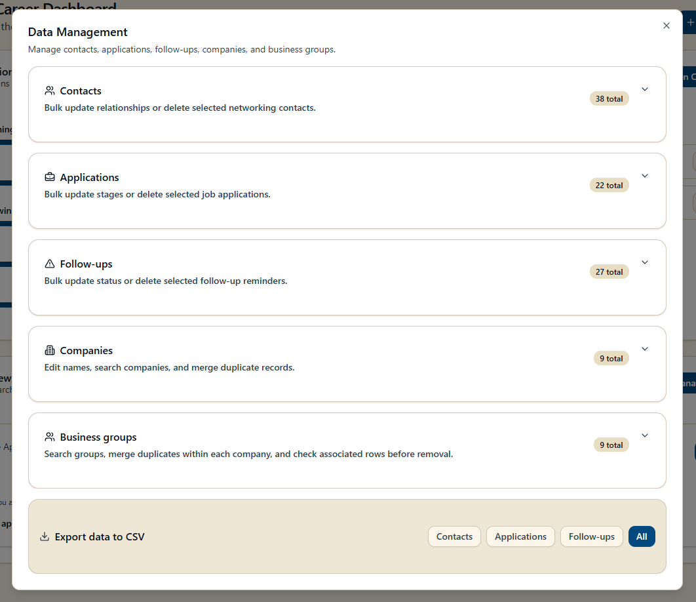

 

---

 

## Exploring Multiple Power Platform Approaches

Because the underlying data was already modeled in Dataverse, I also built a model-driven application against the same tables.

The goal was not to create a second production application, but to gain experience implementing the same business problem through a different Power Platform development model.

The model-driven application demonstrated how quickly Dataverse data could be turned into a functional business application with native forms, views, navigation, and record management.

The Code App, by comparison, provided substantially more control over the user experience, interaction patterns, and visual design.

| Approach | Power Apps Code App | Model-Driven App |
| --- | --- | --- |
| Development model | Code-first | Configuration-first |
| Primary interface | React / TypeScript | Power Platform components |
| UX control | High | Structured / opinionated |
| Dataverse integration | Application-driven | Native |
| Best fit in this project | Primary user experience | Rapid CRUD and administrative workflows |

Building both against the same data model helped me better understand where different Power Apps approaches fit rather than treating one development model as universally better.

 

#### Model-Driven Application

> 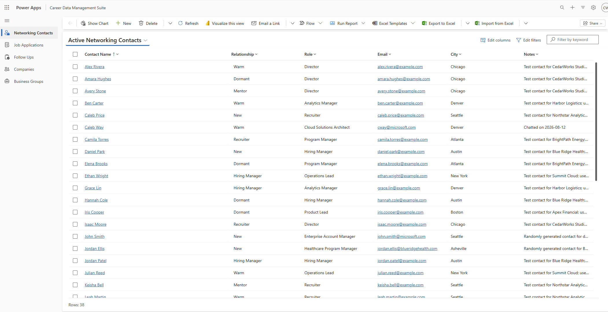

 

---

 

## Technical Decisions & Lessons Learned

### Model the Relationships, Not Just the Records

What initially looked like three simple lists quickly became a relational problem.

Contacts belong to organizations, applications target organizations, business groups provide additional context, and follow-ups can exist because of either a relationship or an application.

Designing around those relationships made the system substantially more useful than maintaining independent lists.

 

### Choose the Data Platform Based on the Problem

Building both SharePoint and Dataverse implementations reinforced that a more capable platform is not automatically the right starting point.

SharePoint supported the initial application surprisingly well. Dataverse became valuable when relational modeling and long-term extensibility became more important, particularly in learning the capabilites of Power Platform and Copilot Studio.

 

### User Experience and Data Administration Are Different Problems

The primary application is optimized around frequent activities such as reviewing opportunities, managing relationships, and completing follow-ups.

Data cleanup, duplicate management, bulk operations, and record merging are less frequent but still necessary.

Separating these into an administrative interface kept those concerns from complicating the primary experience.

 

### Low-Code and Code-First Development Can Complement Each Other

Building a Code App, model-driven application, and multiple data implementations around the same problem gave me a better understanding of Power Platform as an application platform rather than simply a collection of individual tools.

The project also gave me practical experience deciding when configuration, traditional code, AI-assisted development, and platform capabilities each provide the most value.

 

---

 

## Next Steps

Career Development Hub is currently designed around my own career workflow, but its architecture creates several opportunities for further development.

### Email & Calendar Integration

Integrate Microsoft 365 services so follow-ups can create or synchronize calendar events and relevant email activity can be connected to contacts and applications.

### Multi-User Support

Extend the current personal application into a multi-user architecture with appropriate ownership, security roles, and record-level access.

This would allow the same underlying model to support scenarios such as career coaching, transition programs, recruiting teams, or other relationship-driven workflows.

### Embedded Career Agent

I have also built a Career Agent in Copilot Studio that can work with career-management data and workflows.

A future iteration would embed agent capabilities directly into Career Development Hub, allowing users to interact with the system conversationally and perform actions without leaving the application.

> **Check out Career Copilot:** [Explore the Career Agent project →](../career-copilot)

This would combine the structured application and Dataverse system of record with an agentic interface for retrieving information, reasoning across career context, and initiating actions.

 

---

 

## Project Takeaway

Career Development Hub started as a way to improve my own career-management workflow, but became an opportunity to explore how a modern business application can be designed across the full Power Platform stack.

Building the solution required more than creating an interface. It involved defining the business process, modeling relational data, evaluating backend architectures, building multiple application experiences, designing administrative workflows, and considering how automation and agents could extend the system.

Most importantly, the project gave me a practical environment to experiment with newer Power Platform development approaches while solving a problem I was actively experiencing.