<br>

## Overview

Career Development Hub is a personal career management solution I built to keep job applications, networking contacts, follow-ups, interaction history, and calendar activity in one connected system.

I started the project during my own career transition after realizing that the context behind a job search was spread across spreadsheets, LinkedIn, company career portals, notes, and calendar reminders. The more people and opportunities I was tracking, the harder it became to keep the relationships between them clear.

The project evolved into a broader Power Platform solution built around Dataverse. It now includes a custom Power Apps Code App, a model-driven app, a mobile canvas companion app, automated daily briefing, JavaScript-based business logic, and supporting administration workflows.

The goal throughout the project has stayed simple: make it easier to understand what is happening, what needs attention next, and the history behind each relationship or opportunity.

<br>

---

<br>

## Problem

Managing a job search involves more than tracking submitted applications.

Applications are connected to companies, recruiters, hiring managers, networking contacts, conversations, interviews, and follow-up actions. That context becomes difficult to maintain once it is split across several tools.

I wanted a system that could answer practical questions quickly:

- Which applications are currently active?
- Who do I know at a particular company?
- What follow-ups are due today or overdue?
- What happened the last time I spoke with a contact?
- Where is each application in the hiring process?
- What is on my calendar today?

A spreadsheet could store the records, but it did not model the relationships or support the workflows I wanted around them.

<br>

---

<br>

## Solution

Career Development Hub is built around a shared Dataverse data model with several application experiences layered on top of it.

- **Power Apps Code App** for the primary desktop experience
- **Model-driven app** for structured Dataverse forms, views, and administrative workflows
- **Canvas app** as a lightweight mobile companion for quick capture
- **Power Automate** for scheduled workflow automation and daily briefing
- **JavaScript libraries** for client-side business logic in model-driven forms
- **Dataverse** as the system of record across the solution

This lets each interface focus on the kind of work it handles best while keeping the underlying data connected.

<br>

### Choosing the Right App Type

Power Apps offers three ways to build an app, and this project ended up using all three against the same data. That turned out to be the clearest way to learn where each one actually fits.

| | **Canvas App** | **Model-Driven App** | **Code App** |
|---|---|---|---|
| **What it is** | Drag-and-drop screens with Power Fx formulas | Configuration-first UI generated from your Dataverse tables | A React/TypeScript app you write, hosted on Power Platform |
| **Generally used for** | Task-focused and mobile apps, quick capture, guided forms | Record management, back-office and admin apps, data-heavy processes | Custom experiences that need real UI control or third-party libraries |
| **How I used it** | Mobile companion for logging contacts, interactions, and follow-ups on the go | Structured record management, admin workflows, business rules, and JavaScript form logic | The primary desktop experience: dashboard, pipeline, follow-up calendar, and data management |
| **Strengths** | Fastest to build, great on a phone, no code required | Forms, views, search, and security come free with the data model | Full control of layout and behavior, real components, real code |
| **Trade-offs** | Layout is manual, logic lives in formulas, gets unwieldy as it grows | Limited visual control, everything looks like a Dynamics app | You own the code, the build, and the deployment; still in preview |

The short version: if the data model can carry the app, use model-driven. If it needs to be fast and focused on a phone, use canvas. If the experience itself is the point, write it.

<br>

### Career Dashboard

The dashboard is the main starting point for the Code App and provides a quick view of current activity.

It surfaces:

- Application pipeline by stage
- Upcoming and overdue follow-ups
- Calendar activity
- Quick-create actions
- Direct navigation into applications, contacts, and follow-up workflows

Rather than functioning as a static reporting page, the dashboard is designed around the actions I use most often.

#### Dashboard View

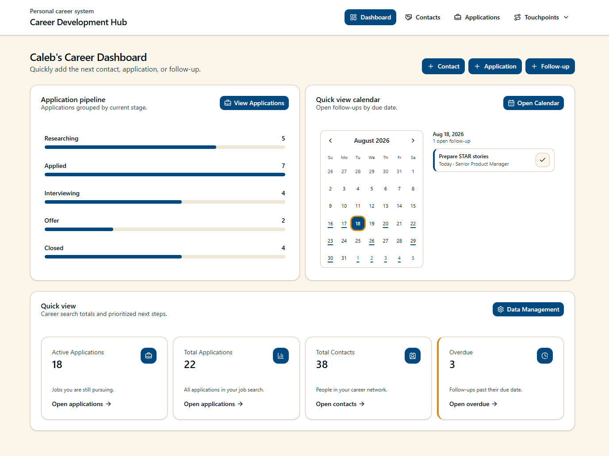

<br>

---

<br>

## Networking & Relationship Management

The contacts workspace keeps professional relationships in the same system as applications and follow-up activity.

Each contact can include company and business group, role, relationship type, contact information, notes, active follow-ups, and interaction history. Search and filtering make it easy to locate contacts across the larger dataset.

#### Contacts Table View

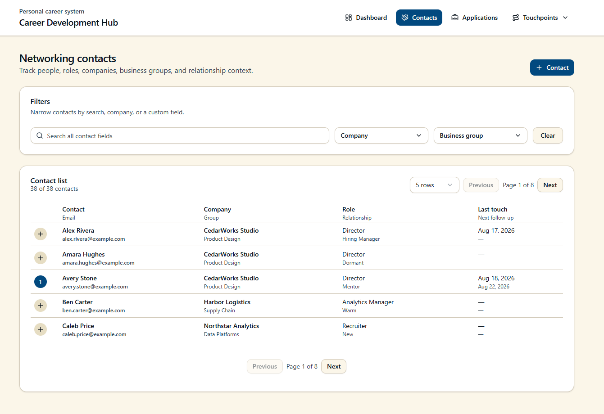

#### Contact Record View

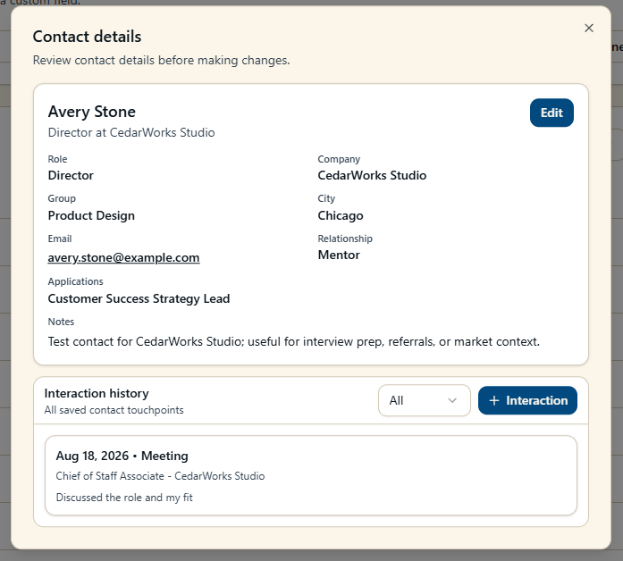

<br>

### Interaction History

I added an **Interactions** feature to improve how relationship history is recorded.

Follow-ups are useful for future actions, but they do not fully capture what has already happened. Interactions provide a dedicated history of conversations, meetings, messages, and other touchpoints associated with a contact.

This makes it easier to open a contact record and understand the relationship without reconstructing the history from notes or completed tasks.

#### Create Interaction

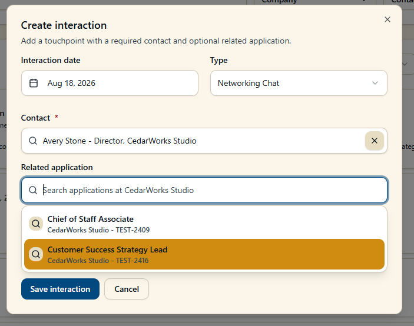

The contact and follow-up workflows also support common actions directly from the record, including reviewing active follow-ups, adding interactions, and completing related follow-ups.

#### Complete a Follow-up and log an interaction

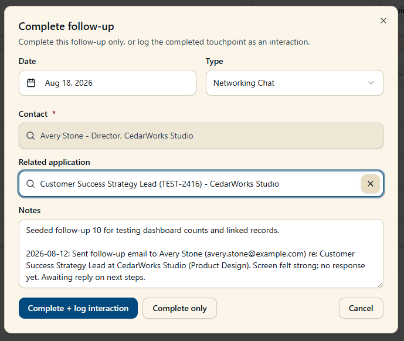

<br>

---

<br>

## Application Pipeline

The applications workspace tracks opportunities through the hiring process while retaining organizational and role-specific context.

Applications include fields such as:

- Role and job ID
- Company and business group
- Location and work arrangement
- Application stage
- Application date
- Job posting link
- Notes and related context
- Associated contacts and follow-ups

The workspace supports both active pipeline management and historical opportunity tracking.

#### Applications View

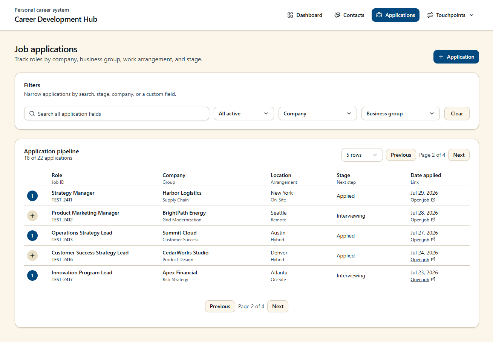

#### Application Record View

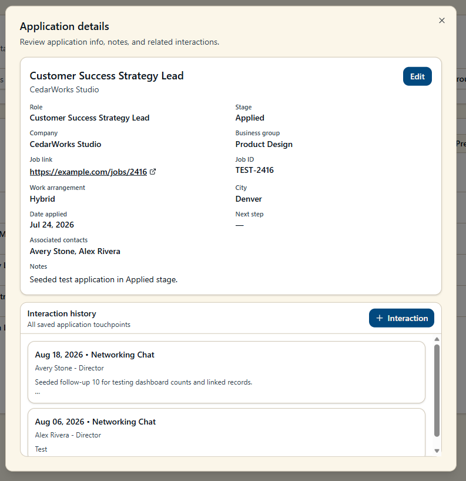

<br>

---

<br>

## Follow-up Management

Follow-ups connect actions and reminders directly to the records that created them.

A follow-up can be associated with a networking contact, an application, or used as a standalone career task. This preserves context that would otherwise be lost in a generic task list or calendar reminder.

The follow-up experience includes:

- Open and completed states
- Due-today and overdue identification
- Contact and application associations
- Search and type filtering
- List and calendar views
- Day, week, and month navigation
- Direct completion from the interface
- Drag-and-drop rescheduling on calendars

#### Follow-up List

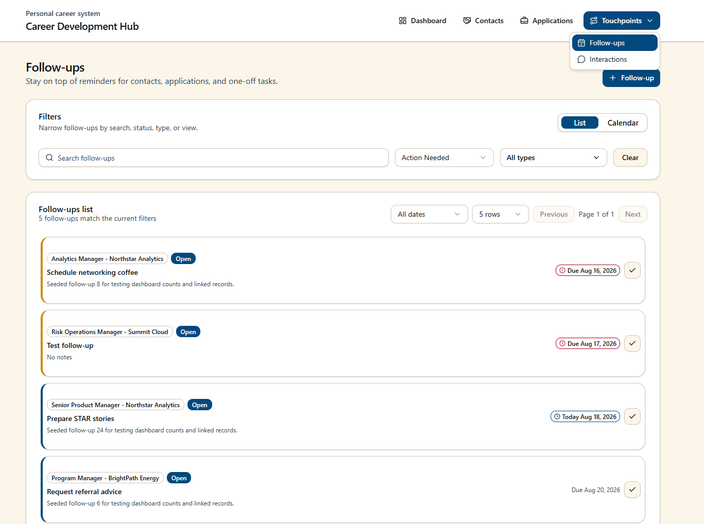

#### Follow-up Calendar

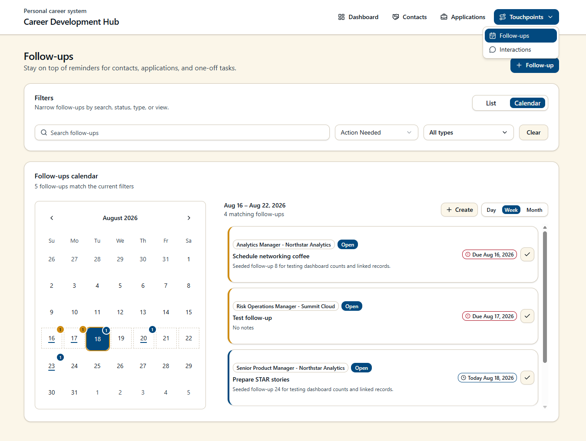

#### Calendar Rescheduling

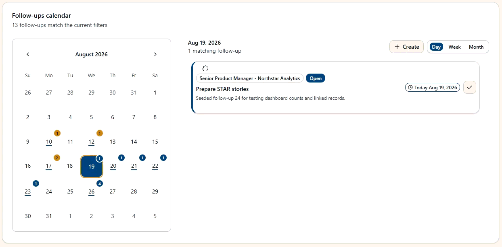

> The drag-and-drop feature for rescheduling follow-ups (shown above) is a great example of where Code Apps excel in user experience.

<br>

---

<br>

## Mobile Companion Canvas App

I built a small canvas app as a mobile companion to the main solution.

The goal was not to recreate the full desktop experience on a phone. The canvas app is intentionally focused on quick capture when I am on a call, at an event, or away from my desk.

It provides a faster way to record common items directly into Dataverse without navigating through the larger Code App or model-driven experience.

#### Mobile Companion App

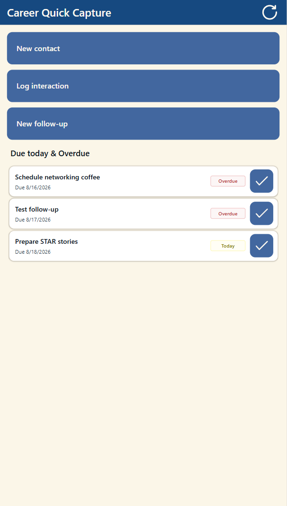

#### Mobile New Record Workflow

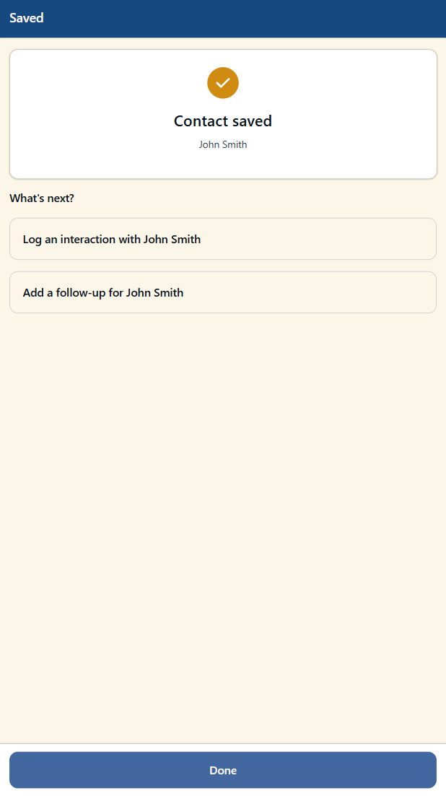

<br>

---

<br>

## Model-Driven App

Because the underlying data is stored in Dataverse, I also built and continued expanding a model-driven application over the same tables.

The model-driven app gives me a more structured environment for native forms, views, record management, and platform-level business logic. It has become useful both as an administrative interface and as a way to explore how the same business process behaves in a configuration-first Power Apps experience.

I also added read-only record views for contacts and applications so users can review information before choosing to edit it.

#### Model-Driven Application

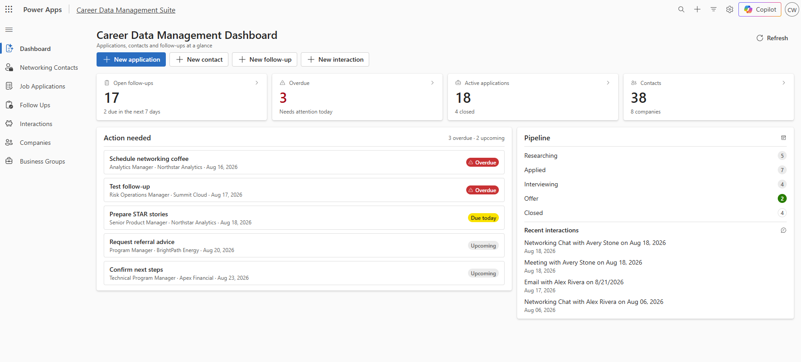

#### Application Record View

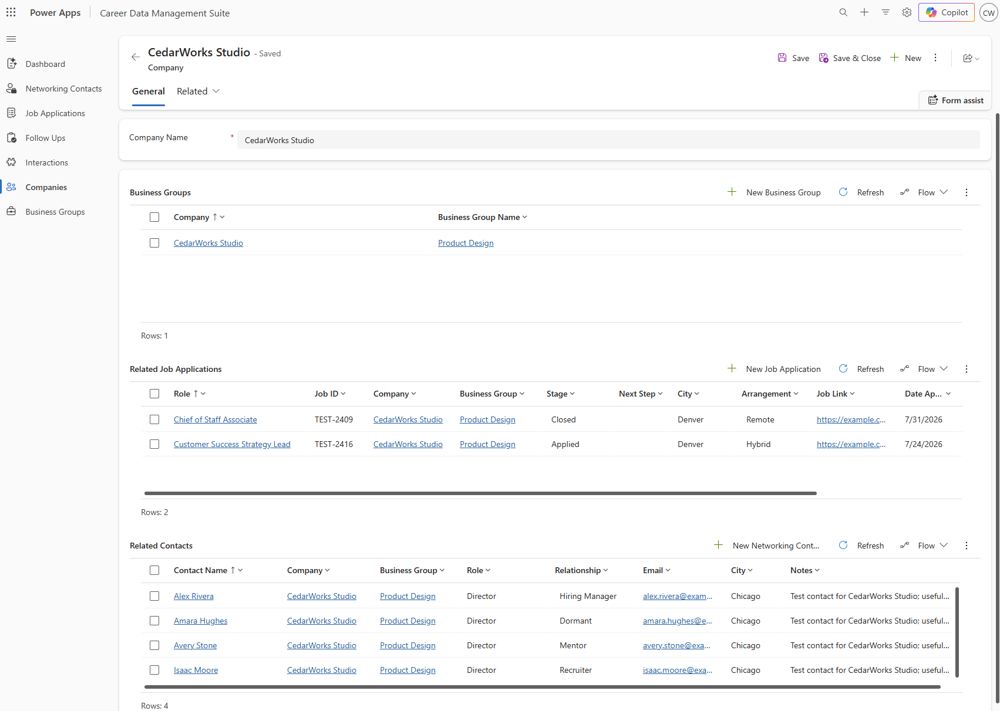

<br>

### JavaScript Event Handlers and Business Rules

As the model-driven app became more complete, I added JavaScript libraries to enforce business rules and reduce repetitive data entry. This enforced the same business and app logic from the Code App experience.

Examples include:

- Setting completion dates when records are marked complete
- Automatically generating interaction names using relevant record data and dates
- Keeping form behavior consistent as record status changes

These were small additions individually, but they made the app feel much more intentional and helped keep stored data consistent.

#### JavaScript Event Handler Example

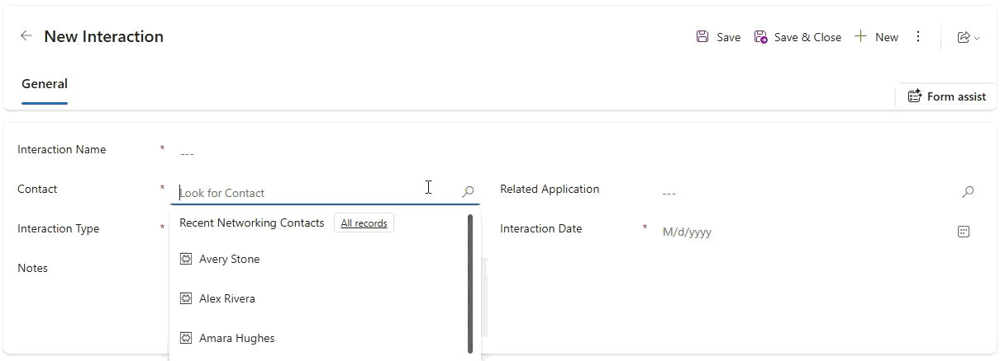

#### Business Rule Example

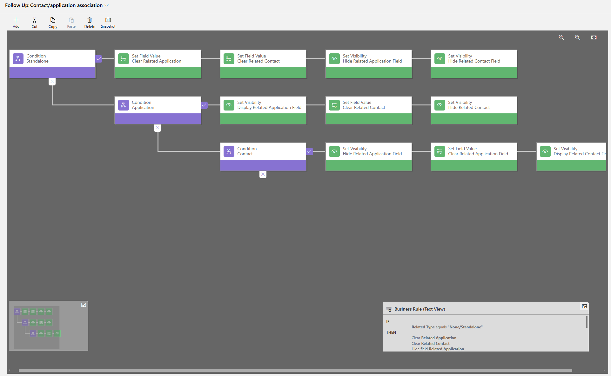

<br>

---

<br>

## Daily Brief Automation

I added a scheduled Daily Brief workflow that pulls together the information I am most likely to need at the start of a working session.

The brief includes:

- Follow-ups due today
- Overdue follow-ups
- Calendar events for the day

This gives me a lightweight summary of what needs attention without requiring me to open the application and manually review several views first.

#### Daily Brief

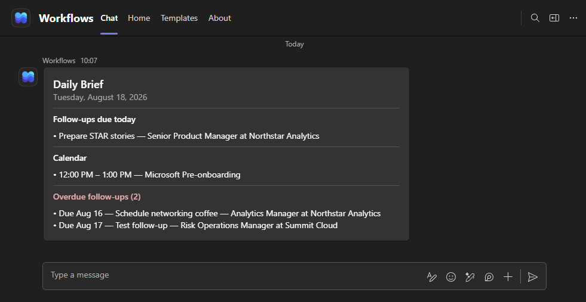

<br>

---

<br>

## Architecture & Data Model

Dataverse serves as the system of record for Career Development Hub. The Code App, model-driven app, canvas app, and automation workflows all work against the same underlying data.

The data model is centered on the relationships that emerge during a career search:

- **Companies** provide the organizational parent for contacts and applications
- **Business Groups** add organizational context within companies
- **Contacts** represent professional relationships
- **Applications** represent individual job opportunities and pipeline status
- **Follow-ups** represent future actions associated with contacts, applications, or standalone tasks
- **Interactions** capture historical relationship activity
- **Contact Application** acts as an intersection table between contacts and applications

That separation between future actions and historical interactions became especially useful as the project matured. A contact record can show both what has already happened and what still needs to happen next.

#### Dataverse Data Model

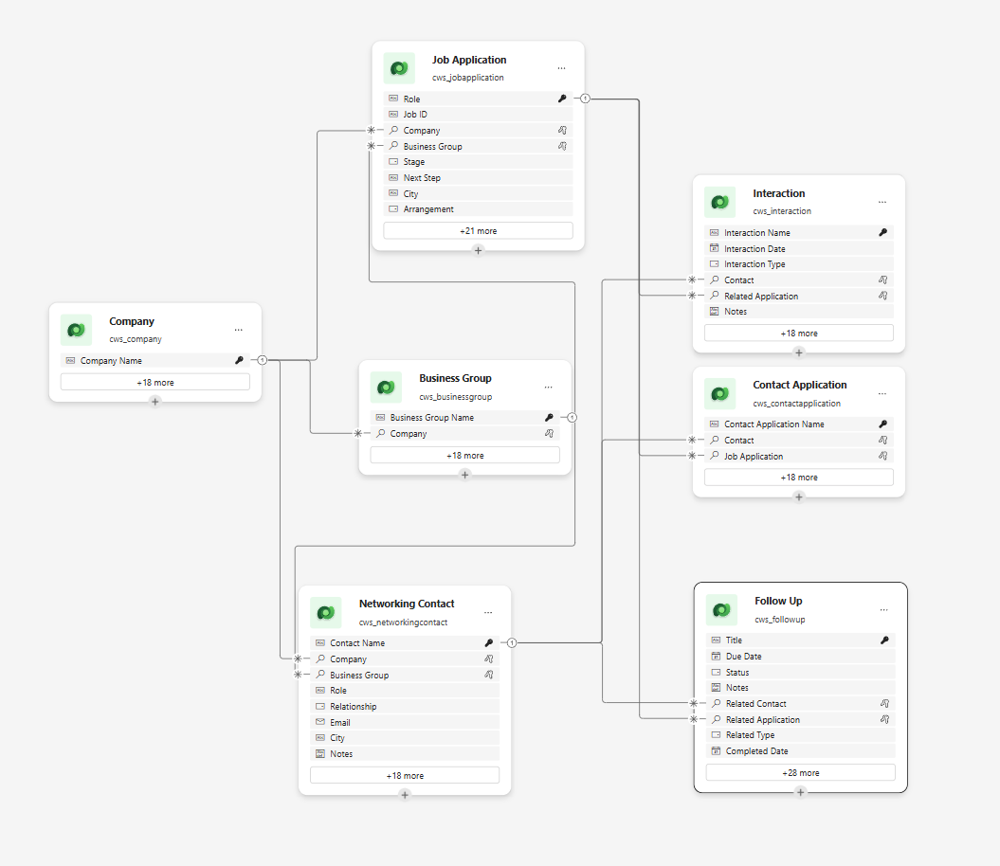

<br>

---

<br>

## Data Management & Administration

As the application grew, maintaining the data became its own workflow.

Instead of relying on direct Dataverse table editing, I built a management interface for administrative tasks across the system.

The panel supports:

- Bulk record management
- Bulk status and stage changes
- Duplicate identification and cleanup
- CSV export
- Company and business group management
- Merging duplicate organizational records
- Reassigning linked records during merges
- Preventing deletion when unresolved dependencies remain

For example, merging duplicate business groups first reassigns their linked contacts and applications to the destination record before removing the duplicate.

This keeps routine career-management workflows separate from the less frequent cleanup and administration tasks behind them.

#### Data Management Panel

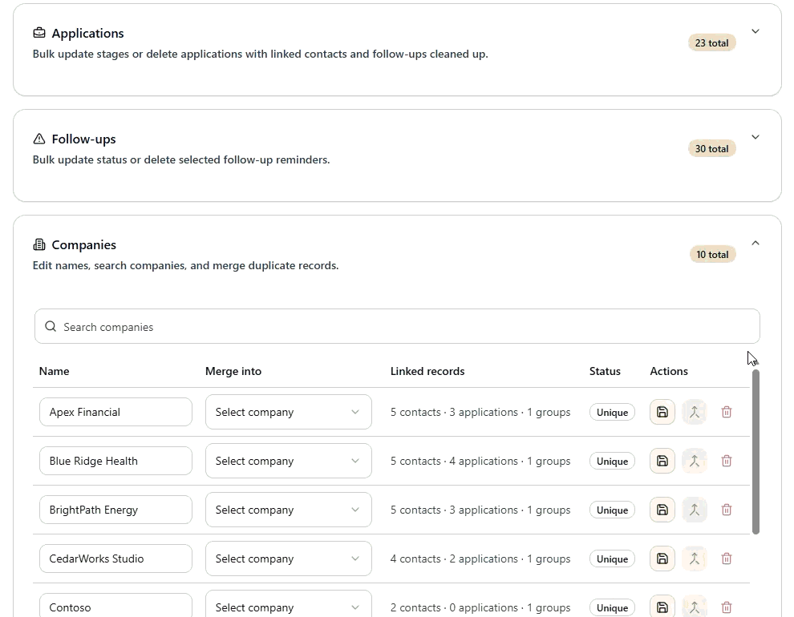

<br>

---

<br>

## How It Got Built: Vibe, Then Claude Code

The Code App started in Microsoft's Power Apps Vibe, an AI-assisted maker experience (currently in preview) that generates an app and its Dataverse connections from a plain-language description. It was later developed with Claude Code with Microsoft's official Power Platform skills and tooling. Both were useful, for different reasons.

Vibe was genuinely strong at two things: building the UI and wiring up the data layer. Describing a screen and getting a working version of it back took minutes, and changes to the Dataverse data model flowed through automatically. Adding a column or a relationship meant the generated services and types were updated for me instead of by hand or through prompts. For getting a real, connected app standing up quickly, it was excellent.

| | **Power Apps Vibe** | **Claude Code + Power Platform skills** |
|---|---|---|
| **Setup** | None. Prompt to running app in one browser tab | Local project with a real build and deploy pipeline |
| **Scope** | The Code App only | The whole solution: Code App, model-driven app, canvas app, flows, Dataverse schema |
| **Best at** | Building UI fast and keeping the data layer in sync automatically | Working across apps, fixing problems at the source |
| **Iterating** | Great for small, contained changes | Handles larger changes and refactors without re-prompting from scratch |
| **Troubleshooting** | Re-prompt and hope; limited visibility into the generated code | Read the actual code, trace the bug, fix it |
| **Version control** | Lives in the browser session | Every change lands in local files, committed to GitHub |
| **Trade-off** | Limited control over the SDK and how the app is put together | More setup before the first working screen |

The version control difference mattered more than I expected. Because Claude Code works directly on local files, every change was immediately visible in my working directory and then could be committed to a GitHub repo. That gave me real history, diffs, and a way to undo a bad change, which is hard to replicate when the app only exists inside a browser session.

Vibe was the better on-ramp for UI and I would start there again. Claude Code was the more comprehensive tool once the solution outgrew a single app.

**Moving off Vibe**

The deciding factor was an SDK limitation. Records created outside the Code App, in the model-driven app, canvas app, or by a Copilot Studio agent, could not be deleted from the Code App. The cause was validation logic inside the generated SDK, which is not editable from within Vibe.

So I took the project files and moved them into a standalone Code App I had full control over. Same app, but with the ability to change the parts Vibe manages on your behalf. The full breakdown is below.

<details>
<summary>⚙️ Technical Note: Dataverse Record Deletion Failure in Code Apps</summary>

<br>

During testing, record deletion failures were discovered when Dataverse records originated from Model-Driven Apps, Canvas Apps, or Copilot Studio agents rather than the generated Code App.

Analysis using Claude Code and Power Platform tooling traced the issue to UUID validation within the generated SDK. Dataverse sequential GUIDs were being rejected by RFC-compliant UUID validation before requests reached Dataverse, despite being valid record identifiers.

#### Identifier Comparison

**RFC-4122 UUID (Accepted by `uuid.validate()`)**

```text
3f2b8c9e-4a6d-4f12-9c7b-8d91e2a6f430
                ^
                Version 4 UUID
```

* Generated by the Code App's client-side SDK
* Follows RFC-4122 UUID version requirements
* Passes `uuid.validate()`
* Delete operations succeed

**Dataverse Sequential GUID (Rejected by `uuid.validate()`)**

```text
aa078335-2f9c-f111-b8db-7ced8d6e75df
                ^
                "f" is not a valid RFC UUID version
```

* Generated by Dataverse, Model-Driven Apps, Canvas Apps, Flows, and Agents
* Valid Dataverse record identifier
* Does not meet RFC UUID version requirements
* Rejected by SDK validation before reaching Dataverse

Analysis revealed that the generated SDK was validating record IDs using RFC UUID version rules rather than Dataverse GUID structure. As a result, valid Dataverse-generated identifiers could fail client-side validation even though Dataverse itself accepted them.

#### Proposed Remediation

The generated framework already supports source-specific identifier validation through the `isValidRecordId` extension point.

```typescript
isValidRecordId: (recordId: string) =>
  /^[0-9a-fA-F]{8}-[0-9a-fA-F]{4}-[0-9a-fA-F]{4}-[0-9a-fA-F]{4}-[0-9a-fA-F]{12}$/.test(recordId)
```

**Why This Works**
- Validates GUID structure (`8-4-4-4-12`) rather than RFC UUID version compliance
- Accepts both client-generated UUIDs and Dataverse-generated sequential GUIDs
- Continues rejecting malformed or invalid identifiers
- Leverages an existing SDK extension point already used by other data sources
- Keeps validation source-specific rather than weakening validation globally

**Architectural Consideration**

The change addresses the immediate issue, but the affected SDK files are generated and managed by Power Apps Vibe and cannot be edited from inside it, which is why the app was moved into a standalone Code App to apply the fix. The more durable solution would be a platform-level update to the Dataverse code-generation template so generated SDKs apply Dataverse-compatible GUID validation by default for dataverse connections.

</details>

<br>

#### Power Apps Vibe Interface

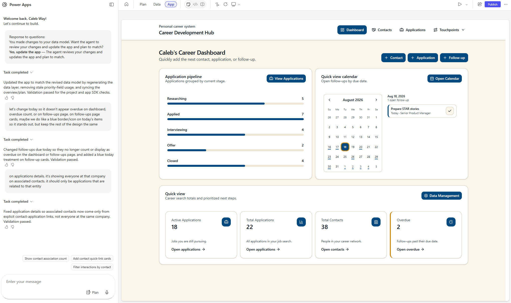

<br>

---

<br>

## Technical Decisions & Lessons Learned

<br>

### Use Different App Types for Different Jobs

Building all three app types against the same Dataverse backend gave me a much clearer sense of where each one fits than reading about them ever did. The comparison is earlier in this write-up, but the short version is that the app type should follow the job, not personal preference.

<br>

### AI Speeds Up the Build, Not the Decisions

Vibe and Claude Code both moved the work along quickly, but the useful parts of this project still came from deciding what the app should do, catching where generated code was wrong, and knowing when to stop trying to work around a tool's limitation and move off it.

<br>

### Small Business Rules Matter

Features such as automatic completion dates, generated interaction names, and read-only record views are not large by themselves, but they reduce friction and keep data more consistent.

The project reinforced that a useful business application depends as much on those workflow details as it does on the larger architecture.

<br>

### Automation Helps Review Disparate Data Quickly

The Daily Brief was a good example of using automation for a narrow, practical purpose. The data was already available in Dataverse and Microsoft 365, so the workflow simply brings the most relevant pieces together at the point I need them.

<br>

---

<br>

## Next Steps

<br>

### Multi-User Support

Extend the current personal solution into a multi-user architecture with ownership, security roles, and record-level access. That could make the same underlying model useful for career coaching, transition programs, recruiting teams, or other relationship-driven workflows.

### Deeper Microsoft 365 Integration

Expand the current calendar and briefing workflows so relevant email and meeting activity can be connected more directly to contacts, applications, and interactions.

### Embedded Career Agent

I have also built a Career Agent in Copilot Studio that works with career-management data and workflows.

> **Check out Career Copilot:** [Explore the Career Agent project →](../career-copilot)

A future iteration could bring those agent capabilities directly into Career Development Hub so structured application data and conversational workflows live in the same experience.

<br>

---

<br>

## Project Takeaway

Career Development Hub started as a tool for my own career transition and gradually became a practical environment for learning how the pieces of Power Platform fit together in a real solution.

The project now spans data modeling, Code Apps, canvas apps, model-driven apps, JavaScript customization, workflow automation, administration, and Copilot Studio. More importantly, each addition came from an actual workflow problem I ran into while using the system.

That has made the project more useful to me than a standalone demo. I can build a feature, use it in my own process, find the friction points, and improve it from there.
