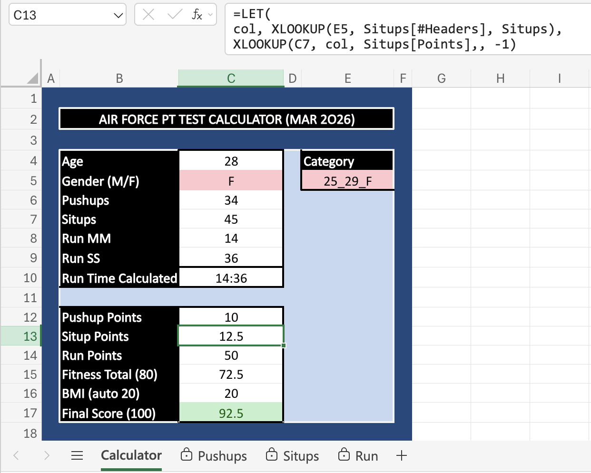
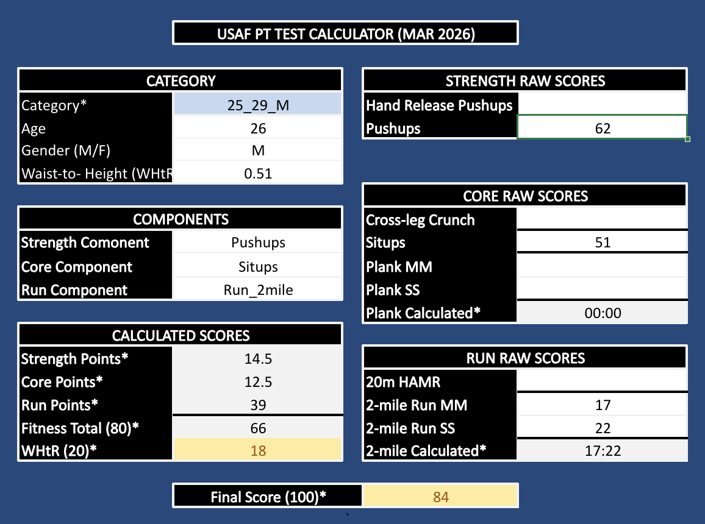
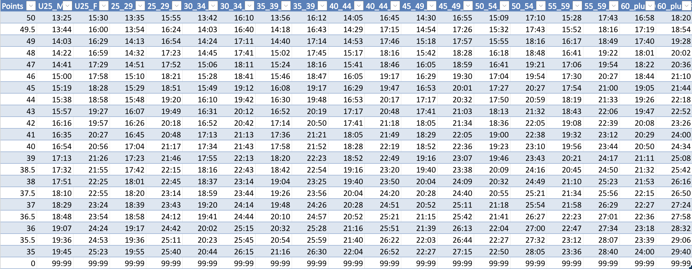
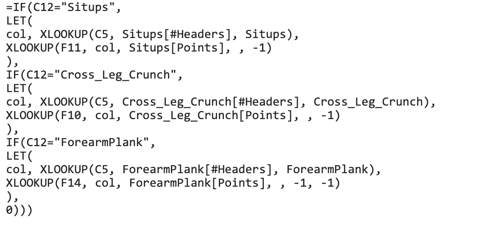
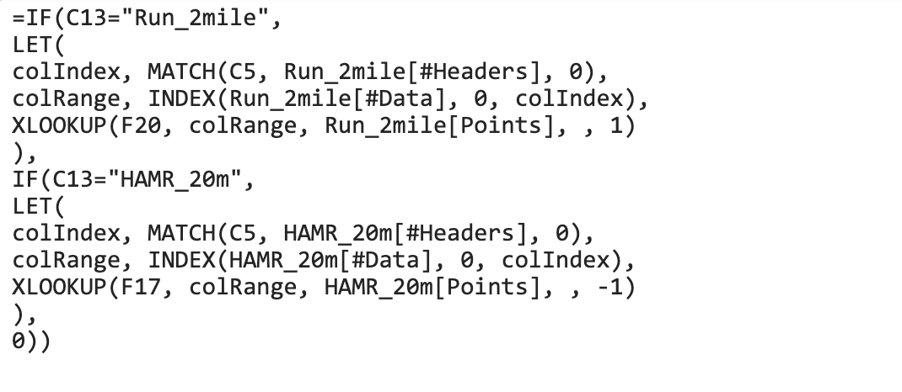

 

## Overview

This project began when our team needed to process the results of over **600 Air Force fitness assessments** shortly after new PT standards were released.

At the time, no official calculator existed to automate scoring. Results normally had to be calculated manually by referencing printed scoring charts and matching results against the correct age and gender category.

To speed up the process and reduce scoring errors, I built an Excel calculator that converts the official scoring charts into structured lookup tables and dynamically calculates component and total scores.

The tool was later expanded into a reusable version supporting all authorized test components used across the organization.

 

---

 

## Problem

Air Force Physical Fitness Assessments are scored using multiple official charts based on age, gender, and the specific test components completed. Each component has its own scoring table.

In practice, this usually requires manually referencing printed charts during testing events. This creates several challenges:

- Manual lookups slow scoring when processing large volumes  
- Chart reading errors can lead to incorrect scores  
- Alternate test components require different scoring tables  
- Verifying scores or comparing alternate test combinations is time-consuming

At the scale of our testing events, manual scoring could take **up to two days** and significantly increased the chance of calculation errors.

 

---

 

## Solution

I built an automated Excel calculator that replicates the official scoring charts and dynamically calculates component and total scores.

AI-assisted development was used to generate initial table structures and formulas. The logic was then iteratively refined and validated against the official scoring standards.

Key features include:

- Converted official scoring charts into structured Excel lookup tables  
- Used data validation to create dropdown menus for selecting test components  
- Built formulas that dynamically switch scoring tables based on selected components  
- Added support for alternate strength, core, and cardio test options  
- Standardized time-based inputs so run and plank events evaluate correctly

The final version supports both student and staff fitness assessment modalities used across the organization.

 

### Initial Operational Version

 

### Expanded Multi-Component Version

 

---

 

## Impact

- Eliminated manual scoring lookups during high-volume testing events  
- Reduced risk of calculation errors when processing hundreds of assessments  
- Enabled rapid evaluation of **600+ fitness assessments in a single week**  
- Created a reusable tool supporting both student and staff testing modalities

 

> Tools: Microsoft Excel, AI-Assisted Development, ChatGPT, Gemini

 

---

 

⚙️ Technical Notes

The primary challenge was translating the official scoring charts into reliable lookup logic.

Each component uses different data types and scoring thresholds. Some events are repetition-based (pushups, situps), others are count-based (HAMR shuttles), and others are time-based (run and forearm plank).

AI was used to generate initial table structures and formulas, but the results required refinement. During testing several edge cases had to be addressed, including:

- rounding behavior differences  
- Excel time formatting issues  
- lookup thresholds returning incorrect rows  
- handling failing component scores correctly

The final implementation organizes each scoring chart as a structured table and applies conditional logic to dynamically select the correct lookup table based on the chosen test component. This modular structure makes the calculator easier to maintain if scoring standards change in the future.

