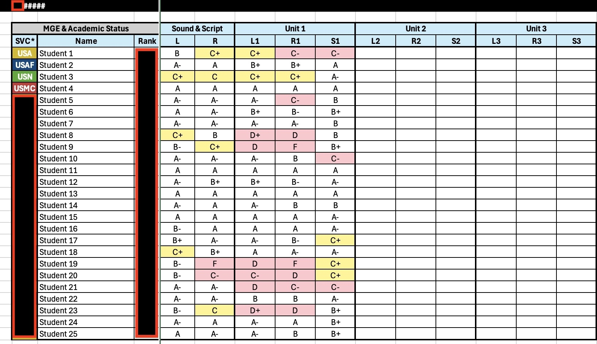
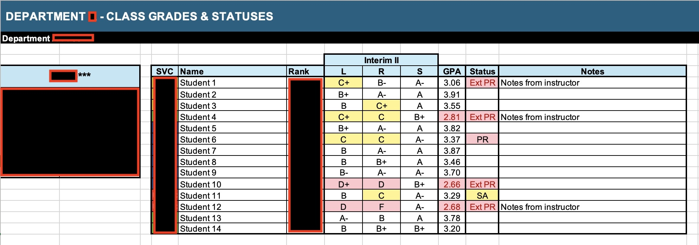

### 🎯 Problem
Our team was spending excessive time creating and formatting academic progress reports. Instructors were:

- Typing grades into PowerPoint slides for biweekly updates  
- Manually color-coding passing vs. failing results with no standard criteria  
- Producing inconsistent report formats across departments  
- Re-typing grades into PDF reports for leadership — slow and error-prone  

Although a database existed, its exported reports weren’t designed for academic decision-making. Leadership only needed performance on major unit tests, but those results were buried among dozens of minor grades. Every department — and often each class — tracked progress differently, leaving no single source of truth for student status.

 

### 💡 Solution
I designed a modular Excel-based reporting system that transformed raw database exports into standardized dashboards with automated formatting and consistent reporting logic. This centralized visibility for instructors, academic leadership, and external service units.

Excel was selected because it required no new licensing, instructors were already proficient with it, and it allowed rapid deployment while larger LMS changes were still years out.

The final system consisted of two primary tools:

 

#### 1. 🏫 Schoolhouse Dashboard
- One workbook with a standardized tab for each department  
- Quick-navigation buttons for faster reviews during sync meetings  
- Raw grade exports pasted directly into input sheets — formatting applied automatically  
- Conditional formatting flagged marginal or failing performance consistently  
- Dropdown selector displayed the most recent scores for any class across listening, reading, and speaking modalities  
- Accessible via Teams and SharePoint, giving leadership a centralized view of student progress  

> Behind the scenes, a modular lookup structure (VLOOKUP + dropdown selectors) matched raw database outputs to student names and surfaced class-specific data in a presentation-ready view.

 

#### 2. 📑 Individual Class Reports
- Displayed each class’s major milestones throughout the year-long curriculum  
- Automatically highlighted students meeting criteria for academic probation, special assistance, or attrition review  
- Offered a linear trend view to support early intervention decisions  
- Generated commander-ready individual student summaries with letter grades across all modalities  

> This tool reused the same modular lookup design, making it easy for departments to adapt without rebuilding formulas.

 

### 🚀 Impact

#### ⏱️ Time Savings
- Eliminated manual grade entry into PowerPoints and individual spreadsheets  
- Reduced administrative workload across all departments  

#### 📊 Standardization
- Introduced a consistent reporting format schoolhouse-wide  
- Made real-time performance data accessible via SharePoint and Teams  

#### 🎯 Decision-Making
- Improved speed and accuracy of academic interventions and attrition boards  
- Enabled a scalable system that could be replicated across curriculums  

 

### 📸 Screenshots

#### 📊 Raw Database Export  
Modular input allowed instructors to paste full database outputs directly into the system — previously unreadable datasets became structured, usable inputs.

  

#### 📑 Individual Class Report  
Updated after each major test to track class-level performance trends and identify students meeting attrition criteria.

  

#### 🏫 Schoolhouse Dashboard View  
Provides a snapshot of each class’s latest unit test performance — used in biweekly syncs and accessible to service units via SharePoint or Teams.

  

#### 👤 Individual Student Report  
Auto-generated commander-ready report displaying a student's results across all major unit tests and modalities.

