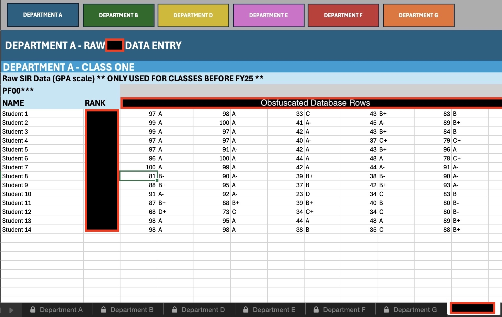
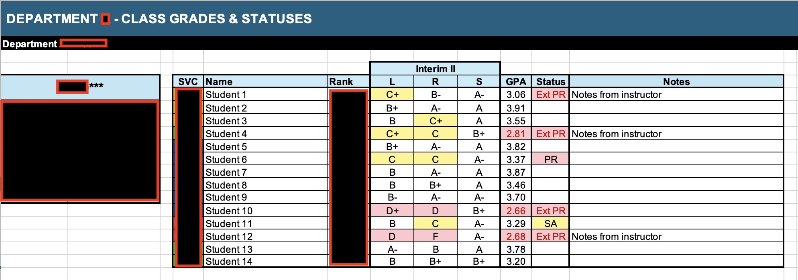
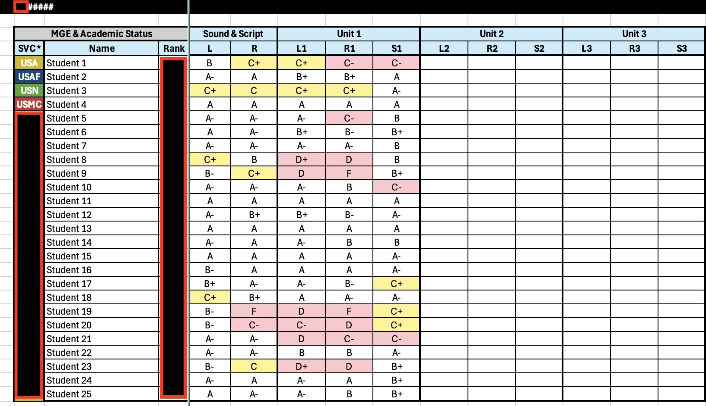
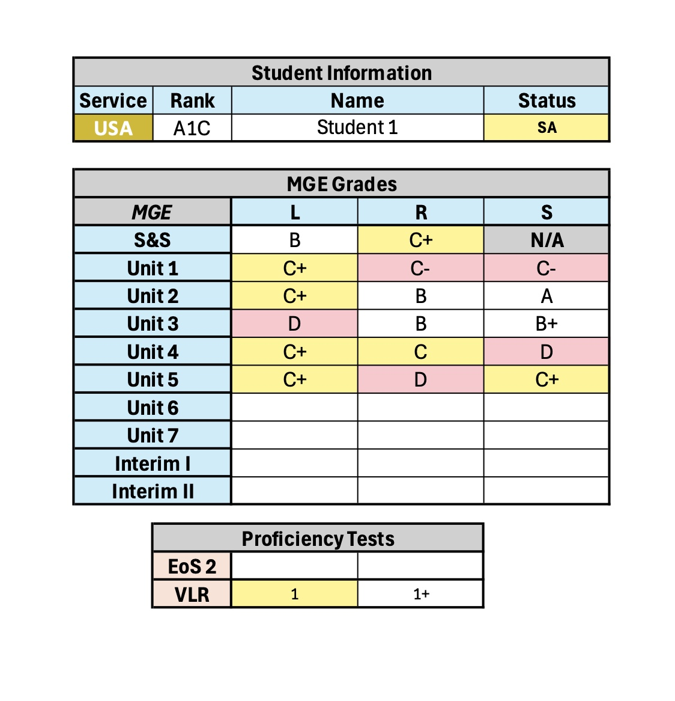

 

## Overview

This project focused on improving how academic progress was tracked and reported across multiple training departments.

Using Excel and SharePoint, I built a set of modular reporting tools that transformed raw database exports into standardized dashboards and reports. The system reduced manual reporting work, highlighted at-risk students earlier, and created a consistent format for leadership reviews.

 

---

 

## Problem

Our team spent significant time manually creating academic progress reports. Instructors were:

- Typing grades into PowerPoint slides for biweekly updates  
- Manually color-coding passing vs. failing results with no standard criteria  
- Producing inconsistent report formats across departments  
- Re-entering grades into PDF reports for leadership reviews  

Although a central database existed, its exported reports were not designed for academic decision-making. Leadership primarily needed performance on major unit tests, but those results were buried among dozens of minor grades.

Each department — and often each class — tracked progress differently, leaving no consistent view of student status.

 

---

 

## Solution

I designed a modular Excel-based reporting system that transformed raw database exports into standardized dashboards and reports.

Excel was selected because it required no additional licensing, instructors were already familiar with it, and it allowed rapid deployment while larger LMS changes were still years away.

The system consisted of two primary tools. Because the reporting structure was modular, departments could adapt the templates for their own programs without rebuilding formulas. The design was later evaluated for broader adoption across the institute.

 

### Schoolhouse Dashboard

A centralized workbook provided leadership with a quick view of student performance across all departments.

- One workbook with a standardized tab for each department  
- Quick-navigation buttons for faster reviews during sync meetings  
- Raw database exports pasted directly into input sheets with automated formatting  
- Conditional formatting highlighting marginal or failing performance  
- Dropdown selectors showing the most recent scores for any class across listening, reading, and speaking modalities  
- Shared through Teams and SharePoint for centralized access  

> Behind the scenes, a modular lookup structure (VLOOKUP and dropdown selectors) mapped raw database outputs to student names and surfaced class-specific data in a presentation-ready format.

 

#### Raw Database Export

Instructors could paste full database exports directly into the system. Previously unreadable datasets became structured inputs for the reporting system.

 

#### Schoolhouse Dashboard View

Provides a snapshot of each class’s most recent unit test performance. This view was used during biweekly sync meetings and shared with service units through SharePoint and Teams.

 

---

 

### Individual Class Reports

These reports tracked each class’s progress throughout the year-long curriculum and highlighted students requiring academic intervention.

- Displayed major academic milestones across the curriculum  
- Automatically highlighted students meeting criteria for probation, special assistance, or attrition review  
- Provided a linear trend view to support early intervention decisions  
- Generated commander-ready individual student summaries with letter grades across all modalities  

> The same modular lookup design allowed departments to adapt the reports for their own classes without rebuilding formulas.

 

#### Class Performance View

Updated after each major test to track class-level performance trends and identify students meeting attrition criteria.

 

#### Individual Student Report

Auto-generated summary displaying a student's results across major unit tests and language modalities.

 

---

 

## Impact

### Time Savings

- Eliminated manual grade entry into PowerPoint and individual spreadsheets  
- Reduced administrative workload across multiple departments  

### Standardization

- Introduced a consistent reporting format across the schoolhouse  
- Made real-time performance data accessible through SharePoint and Teams  
- Created a modular structure adaptable across additional programs within the institute  

### Decision Support

- Improved speed and accuracy of academic intervention decisions  
- Enabled earlier identification of students at risk of failing or attrition