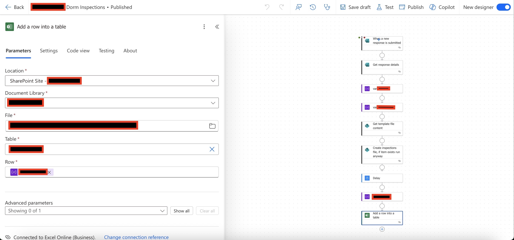
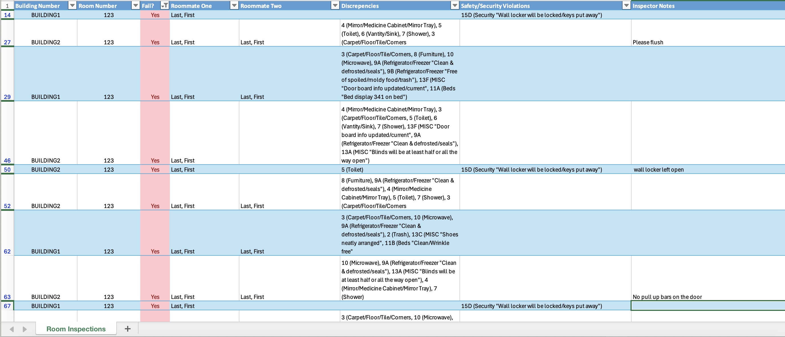
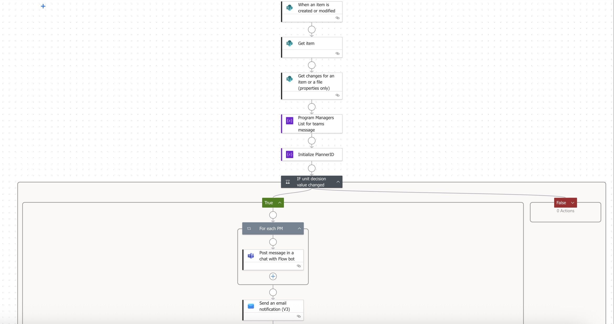
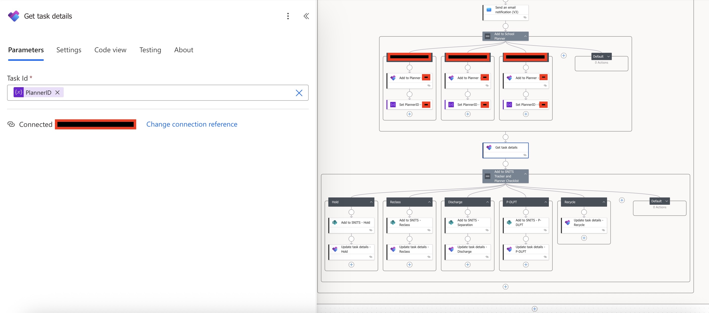
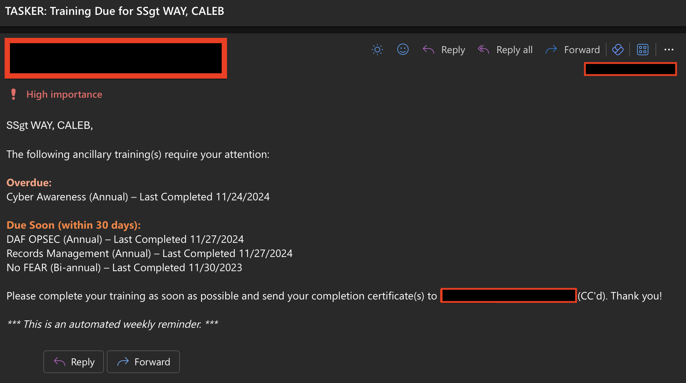

 

## Dorm Inspection System    

### Problem
Dorm inspections for several hundred airmen were completed on paper, requiring hours of manual collation and delaying identification of issues and remediation.  

### Solution
- Rebuilt inspection forms in Microsoft Forms  
- Automated compilation of results into a timestamped Excel report  
- Sent automated Teams + email notifications to inspection teams  

### Impact
- Eliminated manual data entry and paper-based inspection workflows  
- Reduced time to identify and remediate safety issues  
- Supported weekly inspections of several hundred personnel's personal quarters and over $100M+ in Army facilities   

> **Tools:** Power Automate, Microsoft Forms, Excel, Microsoft Teams

⚙️ Technical Notes

Because inspections were conducted at high volume, the flow checks for an existing report for the current date. If no file exists, a new Excel report is created with a date-based filename; if one already exists, the new inspection entry is appended to the existing report.

An automated email notification is sent when a new report is created, alerting the inspection team that updated inspection data is available for follow-up and remediation.

 

---

 

## Administrative Actions Automation   

### Problem
Administrative review and training removal actions were tracked across multiple disconnected SharePoint lists. This required manual duplication of records, ad-hoc follow-up tracking via spreadsheets and email, and sharing status updates through files that quickly became outdated.

These gaps introduced risk: students could be mis-tracked, required actions could be missed, and leadership lacked real-time visibility.  

### Solution
I standardized the underlying SharePoint lists and implemented an automated workflow to manage the full review → status change process:

- Archived review records and generated corresponding “student not in training” entries automatically  
- Created a structured checklist of required follow-up actions  
- Sent Teams notifications and email receipts when status changes were initiated  
- Provided real-time status visibility for staff and leadership directly in SharePoint    

### Impact
- Achieved **100% compliance** for required administrative actions on the day of status change  
- Prevented lost or stalled cases by centralizing tracking and accountability  
- Reduced administrative workload by eliminating duplicate data entry and manual notifications  
- Tracked and managed ~75 students not in training, ensuring timely action and reducing unnecessary taxpayer cost associated with delayed reassignments    

> **Tools:** Power Automate, SharePoint, Microsoft Planner, Microsoft Teams

⚙️ Technical Notes

This workflow included my first implementation of automated Microsoft Planner task creation. A key limitation was that Planner does not natively support creating checklist items ("sub-items") during initial task creation.

To work around this, I initialized a Planner task ID variable at the start of the flow. The variable was used to create the parent task, then referenced later to update the same task with the required checklist items.

 

---

 

## Annual Training Compliance System    

### Problem
Annual training requirements were tracked manually in Excel by one manager. Updating records, sending reminders, and logging certificates consumed 5+ hours weekly and provided limited real-time visibility for leadership.  

### Solution
- Built an automated SharePoint + Power Automate system running weekly compliance checks  
- Auto-sent personalized emails every Monday at 0700, sending an email only to those with **due** or **overdue** trainings  
- Added Power BI dashboards showing compliance rates and outstanding requirements for managers    

### Impact
- Saved 5+ hours weekly in administrative workload  
- Delivered real-time compliance dashboards for leadership  
- Increased training completion rates through proactive reminders    

> **Tools:** Power Automate, SharePoint, Power BI

⚙️ Technical Notes

The primary complexity in this workflow was formatting the output email to clearly separate **upcoming** and **overdue** training items while including relevant context such as due dates and training cadence (annual, bi-annual, etc.).

The flow iterates through each SharePoint training record, evaluates the due date against the current date, and conditionally appends entries to the appropriate array (coming due or overdue). These arrays are then used to dynamically construct a single consolidated reminder email.

Rather than sending individual notifications per overdue item, this approach reduces inbox noise while still prompting timely action.

 

---

 

## Leave & Absence Tracker    

### Problem
Students submitted dozens of absence requests daily across email and Teams messages. Requests were frequently lost in inboxes, approval loops were slow, and irrelevant personnel were often copied.  

### Solution
- Designed an automated workflow that routed requests only to the appropriate approvers  
- Enabled Teams and email notifications for visibility  
- Centralized approvals and status tracking in SharePoint    

### Impact
- Reduced inbox clutter by hundreds of messages monthly by eliminating inconsistent formatting and unnecessary recipients  
- Significantly reduced response times by removing manual follow-up and reply emails  
- Maintained approved absence requests as auditable records in SharePoint, improving accountability and traceability    

> **Tools:** Power Automate, SharePoint, Microsoft Teams

⚙️ Technical Notes

This workflow was one of the larger and more complex automations I've worked on, incorporating multiple layers of conditional logic to evaluate request status (pending, requires additional information, approved, denied, or escalated for review).

Each status path triggered different actions and notifications, ensuring only the appropriate personnel were included at each stage of the approval process.

To account for frequent personnel turnover and reduce maintenance overhead, key names and email addresses were abstracted into variables initialized at the start of the flow. This design choice simplified future updates and made the workflow more resilient to role changes without requiring structural edits.

 

---

 

## Onboarding Automation   

### Problem
Onboarding dozens of students and staff required manually sending multiple emails with dates, links, attachments, and IT requests. This led to missed details and inconsistent communication.  

### Solution
- Built a Power Automate flow triggered from a SharePoint list 
- Sent tailored onboarding emails using over two dozen SharePoint fields  
- Attached branch- or program-specific documents automatically  
- Sent provisioning requests to IT and updated onboarding status fields    

### Impact
- Standardized onboarding across departments  
- Eliminated dozens of manual emails per onboarding cycle  
- Ensured attachments and IT requests were never missed    

> **Tools:** Power Automate, SharePoint, Microsoft Teams

⚙️ Technical Notes

Similar to the leave request workflow, this onboarding process had to account for frequent personnel and process changes. To reduce dependency on technical support, the onboarding email content and attachments were externalized so they could be maintained by non-technical staff.

The email body was stored in a simple text document and retrieved dynamically by the flow. Attachments were sourced from a designated folder in the same location, allowing staff to add or remove documents without modifying the flow. File metadata was appended to an array and passed directly into the email attachment field during execution.

The workflow also generated two separate emails: one for IT onboarding actions and one for the student, populated with class-specific details entered in SharePoint. JSON formatting was used to create an interactive "button" in the SharePoint list, enabling staff to send the emails and mark the item as complete in one step.

