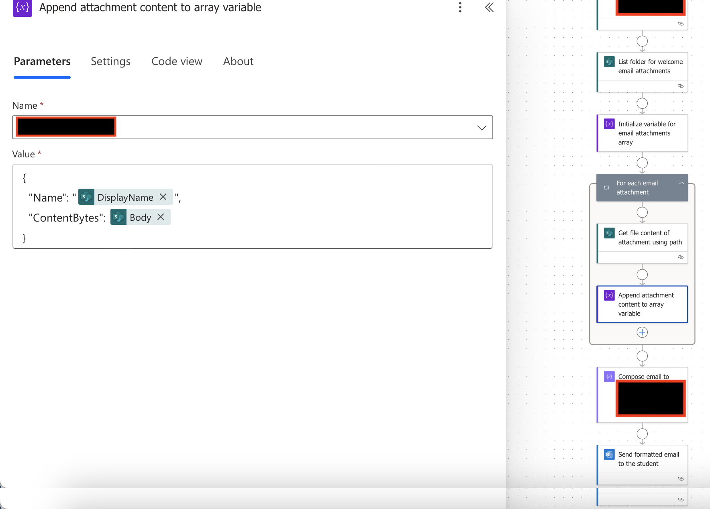
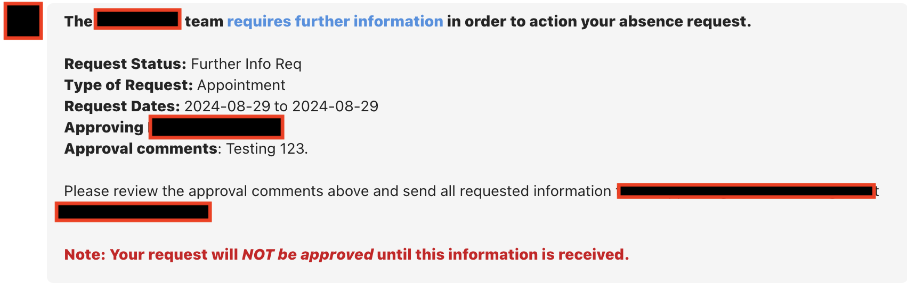

# Projects

A selection of some of the systems I've built using Microsoft Power Platform tools to streamline workflows, cut manual workload, and improve organizational compliance and visibility.   

---
 

## Onboarding Automation 

**Problem**  
Onboarding dozens of new students and staff required manually sending multiple emails (dates, Teams links, attachments, IT requests), leading to errors and delays.  

**Solution**  
- Built a Power Automate flow triggered from a SharePoint button.  
- Sent tailored onboarding emails, pulling from over two dozen fields on SharePoint, including Teams links, dates, times, and locations for onboarding.  
- Automated attachments, sending only the files relevant to each student’s branch, program, or role. 
- Emailed IT for provisioning and auto-marked “initial onboarding complete” in SharePoint.  
 

**Impact**  
- Standardized and accelerated onboarding.  
- Reduced administrative workload by eliminating dozens of manual emails per student group.  
- Ensured IT requests and attachments were never missed.    

> **Tools**: Power Automate, SharePoint, Microsoft Teams

<h4>⚙️ Technical Note: Handling Attachments</h4>

Initially, I struggled to figure out how to send multiple attachments dynamically in automated emails.  

I solved it by using a **for loop** to append the binary data of each file from a shared folder into an array variable, then passing that array into the email’s attachments field. 

This allowed the team to simply update files in the shared folder whenever policies changed, ensuring onboarding emails always included the most up-to-date attachments without modifying the flow itself.

 
 

--- 
 

## Leave & Absence Tracker  

**Problem**  
Students submitted dozens of class absence requests daily via email/teams, coming from multiple campuses and programs. Requests were frequently lost in inboxes, approvals delayed, and unnecessary stakeholders spammed with irrelevant emails.  

**Solution**  
- Designed a Power Automate system that routed requests dynamically to only the required approvers.  
- Enabled Teams + email notifications for accessibility and visibility.  
- Centralized tracking of approvals and status updates in SharePoint.  

**Impact**  
- Reduced email clutter by hundreds of messages monthly for certain teams.
- Cut ~20 hours per week of administrative overhead across 3 teams.  
- Brought average response times from days to minutes for some requests, with all requests answered within 24 hours.   

 > **Tools**: Power Automate, SharePoint, Microsoft Teams
 
 

<h4>⚙️ Screenshot: Example message to students</h4>

When the student's absence request status changed (approved, denied, needed more info), an email and teams message was sent directly to the student and the required approving parties, reducing inbox clutter and speeding response times. The messages were tailored to the student vs faculty view.

 
 

---
 

## Dorm Inspection System  

**Problem**  
Dorm inspections for several hundred airmen were completed on paper, requiring hours of manual collation and delaying identification of failures.  

**Solution**  
- Rebuilt inspection forms in Microsoft Forms.  
- Automated Power Automate flow to compile results into a dated Excel report.  
- Triggered automated email and teams message to inspection teams when new reports were generated.  

**Impact**  
- Eliminated manual data entry and paper handling.  
- Allowed faster identification of airmen requiring remediation.  
- Streamlined weekly inspections for hundreds of personnel.    

 > **Tools**: Power Automate, Microsoft Forms, Excel, Teams

---
 

## Annual Training Compliance System  

**Problem**  
Annual compliance training for every member was tracked manually in Excel by one manager. Updating records, sending reminders, and logging certificates consumed 5+ hours weekly and offered no visibility for leadership.  

**Solution**  
- Built a SharePoint + Power Automate system to iterate through training records every Monday.  
- Auto-sent personalized emails listing trainings due in 30 days and overdue items.  
- Integrated Power BI to create dashboards showing compliance rates by section and overdue lists for leadership.  
- Enabled members to submit certificates directly to the system for streamlined updates.  

**Impact**  
- Saved 5+ hours weekly in manual admin work.  
- Provided real-time visibility for leadership via dashboards.  
- Increased compliance by making requirements clear and proactive.  

> **Tools**: Power Automate, SharePoint, Power BI

