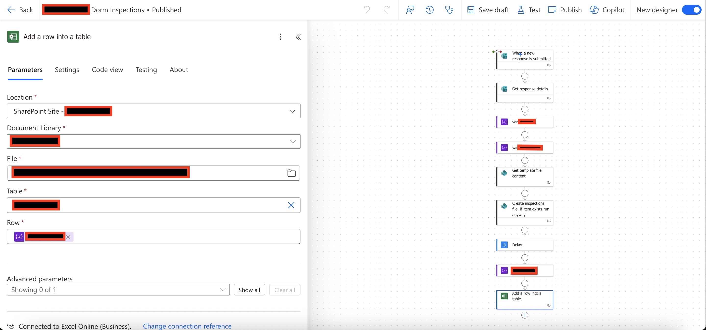
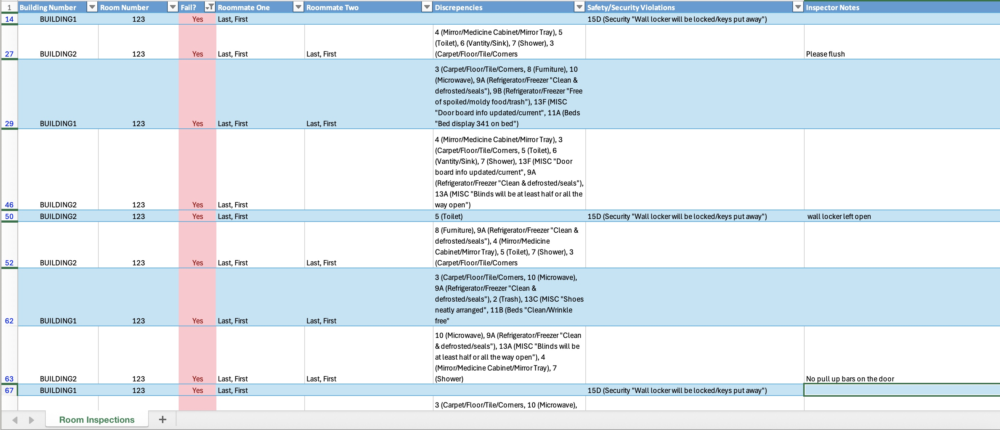
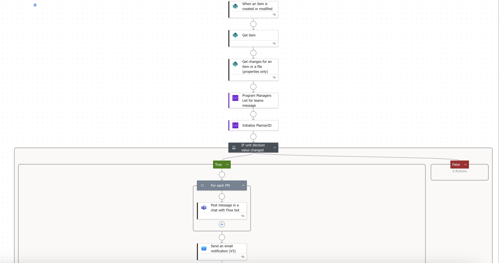
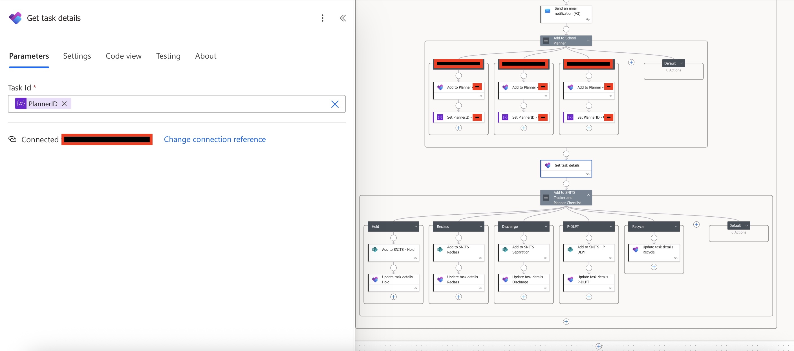
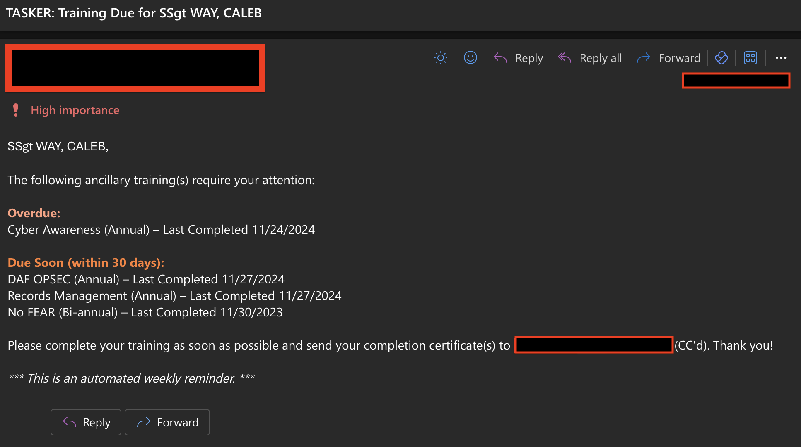
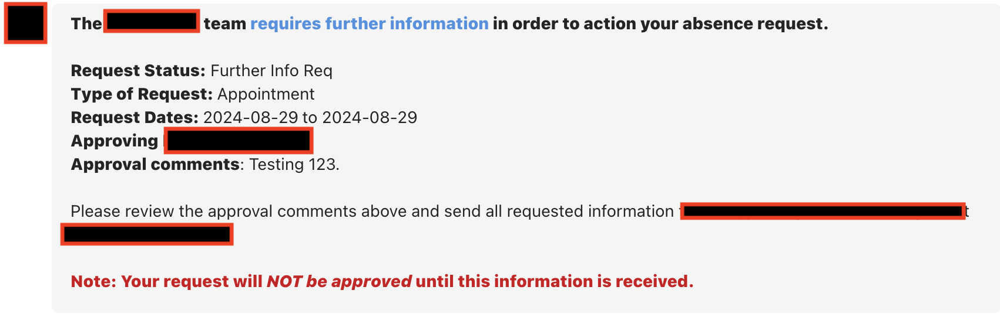
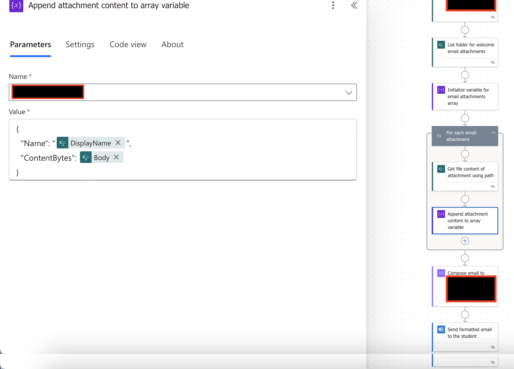

 

## Overview

The following examples highlight several real-world automations built using **Power Automate and Microsoft 365**.

Each workflow replaced manual processes with automated systems that improved visibility, reduced administrative workload, and standardized operations across multiple training organizations.

 

---

 

## Dorm Inspection System

### Problem

Dorm inspections for several hundred airmen were completed on paper, requiring hours of manual collation and delaying identification of issues and remediation.

### Solution

- Rebuilt inspection forms in Microsoft Forms  
- Automated compilation of results into a timestamped Excel report  
- Sent automated Teams and email notifications to inspection teams

### Impact

- Eliminated manual data entry and paper-based inspection workflows  
- Reduced time to identify and remediate safety issues  
- Supported weekly inspections of several hundred airmen’s quarters and over $100M in Army facilities

> **Tools:** Power Automate, Microsoft Forms, Excel, Microsoft Teams

⚙️ Technical Notes

Because inspections were conducted at high volume, the flow checks for an existing report for the current date. If no file exists, a new Excel report is created with a date-based filename; if one already exists, the new inspection entry is appended to the existing report.

An automated email notification is sent when a new report is created, alerting the inspection team that updated inspection data is available for follow-up and remediation.

 

---

 

## Administrative Actions Automation

### Problem

Administrative review and training removal actions were tracked across multiple disconnected SharePoint lists. This required manual duplication of records, ad-hoc follow-up tracking through spreadsheets and email, and sharing status updates through files that quickly became outdated.

These gaps created risk: students could be mis-tracked, required actions could be missed, and leadership lacked real-time visibility.

### Solution

I standardized the underlying SharePoint lists and implemented an automated workflow to manage the full review → status change process:

- Archived review records and generated corresponding “student not in training” entries automatically  
- Created a structured checklist of required follow-up actions  
- Sent Teams notifications and email receipts when status changes were initiated  
- Provided real-time status visibility for staff and leadership directly in SharePoint

### Impact

- Achieved **100% compliance** for required administrative actions on the day of status change  
- Prevented lost or stalled cases by centralizing tracking and accountability  
- Reduced administrative workload by eliminating duplicate data entry and manual notifications  
- Tracked and managed ~75 students not in training, helping ensure timely action and reduce unnecessary taxpayer cost associated with delayed reassignment

> **Tools:** Power Automate, SharePoint, Microsoft Planner, Microsoft Teams

⚙️ Technical Notes

This workflow included my first implementation of automated Microsoft Planner task creation. A key limitation was that Planner does not natively support creating checklist items during initial task creation.

To work around this, I initialized a Planner task ID variable at the start of the flow. The variable was used to create the parent task, then referenced later to update the same task with the required checklist items.

 

---

 

## Annual Training Compliance System

### Problem

Annual training requirements were tracked manually in Excel by a single manager. Updating records, sending reminders, and logging certificates consumed over five hours weekly while providing limited real-time visibility for leadership.

### Solution

- Built an automated SharePoint + Power Automate system running weekly compliance checks  
- Sent personalized emails every Monday at 0700, notifying only personnel with **due or overdue** training  
- Added Power BI dashboards showing compliance rates and outstanding requirements

### Impact

- Saved 5+ hours weekly in administrative workload  
- Delivered real-time compliance dashboards for leadership  
- Increased training completion rates through proactive reminders

> **Tools:** Power Automate, SharePoint, Power BI

⚙️ Technical Notes

The primary complexity in this workflow was formatting the output email to clearly separate **upcoming** and **overdue** training items while including relevant context such as due dates and training cadence.

The flow iterates through each SharePoint training record, evaluates the due date against the current date, and conditionally appends entries to arrays representing either upcoming or overdue training.

These arrays are then used to dynamically construct a single consolidated reminder email.

Rather than sending individual notifications per overdue item, this approach reduces inbox noise while still prompting timely action.

 

---

 

## Leave & Absence Tracker

### Problem

Students submitted dozens of absence requests daily through email and Teams messages. Requests were frequently lost in inboxes, approval loops were slow, and irrelevant personnel were often copied on communications.

### Solution

- Designed an automated workflow routing requests to the appropriate approvers  
- Enabled Teams and email notifications for visibility  
- Centralized approvals and status tracking in SharePoint

### Impact

- Reduced inbox clutter by hundreds of messages monthly  
- Improved response times by eliminating manual follow-up emails  
- Maintained approved absence requests as auditable records in SharePoint

> **Tools:** Power Automate, SharePoint, Microsoft Teams

⚙️ Technical Notes

This workflow incorporated multiple layers of conditional logic to evaluate request status (pending, requires additional information, approved, denied, or escalated).

Each status path triggered different actions and notifications so only the appropriate personnel were included at each stage.

To account for frequent personnel turnover and reduce maintenance overhead, key names and email addresses were stored in variables initialized at the start of the flow. This allowed updates without modifying the workflow structure.

 

---

 

## Onboarding Automation

### Problem

Onboarding dozens of students and staff required manually sending multiple emails containing dates, links, attachments, and IT requests. This often led to missed details and inconsistent communication.

### Solution

- Built a Power Automate workflow triggered from a SharePoint list  
- Sent tailored onboarding emails using over two dozen SharePoint fields  
- Automatically attached branch- or program-specific documents  
- Sent provisioning requests to IT and updated onboarding status fields

### Impact

- Standardized onboarding communication across departments  
- Eliminated dozens of manual emails per onboarding cycle  
- Ensured attachments and IT requests were consistently included

> **Tools:** Power Automate, SharePoint, Microsoft Teams

⚙️ Technical Notes

To reduce long-term maintenance overhead, onboarding email content and attachments were externalized so non-technical staff could manage updates.

The email body was stored in a text document and retrieved dynamically by the flow. Attachments were sourced from a designated folder and passed into the email dynamically.

The workflow generated two emails: one for IT onboarding tasks and one for the student. JSON formatting was used to create an interactive button in the SharePoint list, allowing staff to trigger onboarding emails and mark the item complete in a single step.

