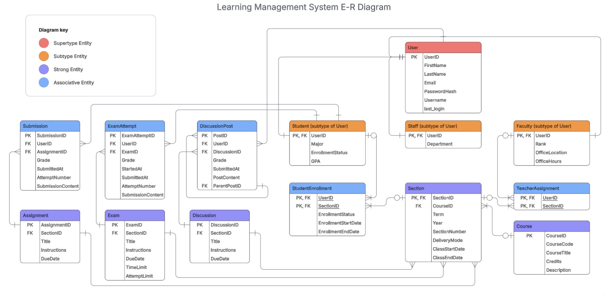

 

## Overview

This project explores core relational database design concepts using a simplified learning management system (LMS) scenario.

The goal was to practice structuring a system around clear entities, relationships, and normalized data while modeling common LMS workflows like enrollment, coursework, and grading.

Rather than building a full application, this project focuses on how the data model supports the system.

 

---

 

## Design Goals

The model was designed around a few basic system requirements:

- Users can participate in different roles (student, faculty, staff)
- Students enroll in course sections
- Faculty are assigned to teach sections
- Coursework (assignments, exams, discussions) lives inside sections
- Student activity like submissions and attempts can be tracked over time

These requirements helped shape the relationships between entities and ensured the system could support typical LMS workflows.

 

---

 

## Key Modeling Concepts

### Role-Based User Structure

Users share common identity and authentication data, but participate in the system through different roles.

To support this, the model uses a **supertype/subtype design**:

- **User** (core identity record)
  - Student
  - Faculty
  - Staff

This keeps authentication centralized while allowing role-specific attributes to live in separate tables.

 

### Resolving Many-to-Many Relationships

Several parts of the system require many-to-many relationships.

Instead of linking entities directly, the model resolves these using associative tables:

- `StudentEnrollment` → connects students and sections
- `TeacherAssignment` → connects faculty and sections
- `Submission` → connects students and assignments
- `ExamAttempt` → connects students and exams
- `DiscussionPost` → connects users and discussion threads

This structure keeps the data normalized and prevents duplication.

 

### Section-Centered Coursework

Most learning activity happens within the context of a **course section**.

Assignments, exams, and discussions are all tied to `Section`, which allows each section of the same course to have its own schedule, instructors, and coursework.

This makes the model flexible for different instructors or terms while still keeping courses organized.

 

---

 

## Data Model

Core entities include:

- User
- Student / Faculty / Staff
- Course
- Section
- StudentEnrollment
- TeacherAssignment
- Assignment
- Exam
- Discussion
- Submission
- ExamAttempt
- DiscussionPost

The model also includes examples of:

- **Activity tracking** (submissions, exam attempts)
- **Threaded discussions** using a self-referencing relationship
- **Lifecycle data** such as enrollment status and timestamps

 

---

 

## What This Demonstrates

This project highlights several foundational database design concepts:

- Structuring systems around clear entities
- Normalizing data to reduce duplication
- Resolving many-to-many relationships
- Modeling hierarchical data (discussion replies)
- Designing schemas that support real operational workflows